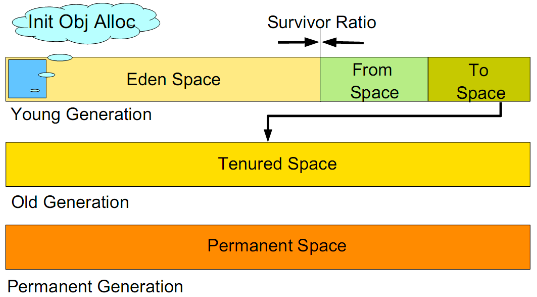

# In-depth Understanding of JVM Memory

## Heap Memory

During the execution of Java programs, the Java Virtual Machine divides the memory it manages in the main memory into several regions, each storing different types of data. The largest portion of memory space is called the heap (Heap), which is the runtime data area of the Java Virtual Machine, where all instances and arrays are stored.

The heap is created when the Java Virtual Machine starts up, is shared by all threads, and is also the main working area for the garbage collector, hence this part of the area is also called **Heap Memory** or **GC Heap**. When the garbage collector recycles data in the heap, it scans and clears useless objects created with the `new` keyword, freeing up memory and avoiding waste of memory resources.

To improve the efficiency of garbage collection, the heap memory is further divided into the Young Generation, Old Generation, and Permanent Generation.

* **Young Generation**: Includes the Eden area, SurvivorFrom area, and SurvivorTo area, used for storing newly created objects. Most new objects are allocated in the Eden area (if an object is too large, it is directly allocated to the Old Generation), and the process of garbage collection in the Young Generation is called **Minor GC**. When the memory in the Eden area is insufficient, Minor GC is triggered.  Before Minor GC starts, objects only exist in the Eden area and SurvivorFrom area; during Minor GC, surviving objects from the Eden area and SurvivorFrom area are moved to the SurvivorTo area, and their age is increased by 1, while the Eden area and SurvivorFrom area are cleared; after Minor GC, the functions of the SurvivorFrom area and SurvivorTo area are swapped, and during the next Minor GC, surviving objects from the SurvivorTo area and Eden area are moved to the SurvivorFrom area, and the age of the objects is calculated. When an object's age reaches 15, it is allocated to the Old Generation.

* **Old Generation**: Also known as the Tenured area, used for storing objects that have survived from the Young Generation. The process of garbage collection from the Old Generation area is called **Major GC**. The Old Generation stores more stable objects and does not frequently perform Major GC. Major GC is triggered only when new objects enter the Old Generation causing insufficient space, or when the program cannot find a large enough continuous space to allocate to newly created large objects.  Because scanning and recycling are required, Major GC takes a longer time. Major GC produces memory fragmentation, and when the Old Generation also does not have enough memory to allocate to incoming objects, an OOM (Out of Memory) exception is thrown.

* **Permanent Generation**: Also known as the permanent storage area, mainly stores Class and Meta (metadata) information. In Java 8, the Permanent Generation was removed and replaced by the Metaspace area. Metaspace is not in the virtual machine but uses local memory. Therefore, by default, the size of Metaspace is only limited by local memory.

## Non-Heap Memory

Non-Heap Memory refers to the memory area managed outside the Java Virtual Machine's heap, allocating some object instances in memory areas outside the Java Virtual Machine's heap memory, which are directly managed by the operating system (not the virtual machine), including Code Cache area, Metaspace/Permanent Space.

Area explanations are shown in the table below.

| Non-Heap Memory Area       | Description                           |
|----------------------------|---------------------------------------|
| **Code Cache**             | Area for compiling and storing native code. |
| **Permanent Space**        | Area for storing static data of the virtual machine, such as class and method objects. |
| **Meta Space**             | Metaspace, area for storing class metadata in localized memory. |
| **Direct Buffer**          | Direct buffer area.                   |
