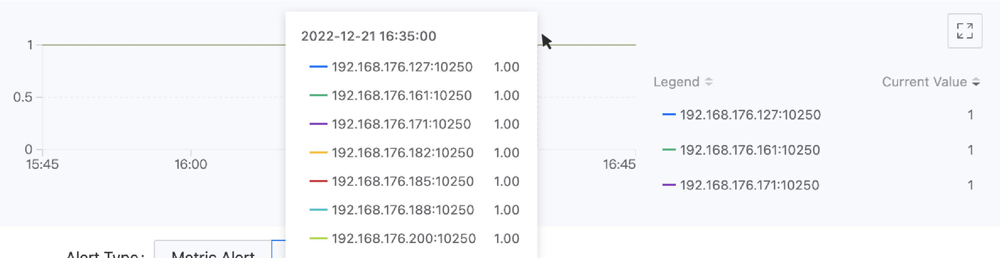

# Alert Policies

You can create a custom alert policy on the ASM platform by yourself, or you can quickly create one using a template provided by the administrator in platform management.

## Creating Personalized Alert Policies

Based on the platform's monitoring, log, and event data, combined with the platform's notification functionality, create metric alerts, custom alerts, log alerts, and event alert types for services and computational components under the same namespace in the current service mesh. When the resources targeted by the alert policy experience anomalies or the monitoring data reaches the predefined warning state, alerts are automatically triggered and notifications are sent.

### Prerequisites

* If you need the alert configuration to automatically notify, please contact the platform administrator in advance to configure the **Notification Policy** in the **Platform Management** view.

* Ensure that the cluster where the alert policy's resources are located has the monitoring component deployed, so that the alert policies created based on monitoring metrics can take effect.

* Ensure that the cluster where the alert policy's resources are located has the Elasticsearch component deployed, so that the alert policies created based on logs and event query results can take effect.

### Quick Start

1. In the left navigation bar, click **Alerts** > **Rules**.

2. Click **Create Rule**.

### Basic Information

In the **Basic Information** area, configure the basic information of the alert policy. You need to first select different types of alerts.

**Resource Alerts**

Alert types divided according to monitoring resource categories, for example, the following two scenarios:

1. You can continuously monitor some or all Deployments under the current namespace, and trigger an alert when their deployment status is not Running.
2. You can continuously monitor a specific microservice under the current namespace, and trigger an alert when its service traffic error rate exceeds 20%.

Tips:
- If no related parameters in the resource object are selected, it defaults to **Any**. Subsequent **deletion/addition** of resource objects will **dissociate/automatically associate** the alert policy.
- **Services** are optional and can also be specified by entering and pressing enter. When entering, it supports matching service names with regular expressions, such as `cert.*`.

**Event Alerts**

Alert types divided according to K8s events, for example, the following scenario:

For a Pod named Nginx under the current namespace, after adding a matching rule, an alert can be triggered when the Pod's status is Failed.

Tip: If no selection is made in the matching rules, it will select all resources under some resource, and subsequent **deletion/addition** of resources will **dissociate/automatically associate** the alert policy.

**Quick Tips**

If you expect to continuously monitor the OpenTelemetry service, please select **Resource Alerts** and choose the governance method as **OpenTelemetry**.

### Alert Rules

Once you have selected the alert type and set the monitoring range based on the above instructions, you can add the corresponding alert rules.

#### __Resource Alerts__

1. In the **Rules** area, click **Add Alert Rule**.

   **Note**: The monitoring chart displayed above the dialog box provides a data preview of the monitoring metrics or expressions, which changes in real-time based on your selection. You can reconfirm your input based on the chart.

   

2. Select the alert type and refer to the following instructions to configure the alert rules.

**Metric Alerts**: Select the alert metrics preset by the platform.

**Custom Alerts**

Please refer to the instructions below to enter relevant data:
- Metric Name: Enter the name of the current custom metric for easier management and retrieval.
- Expression: You need to add a specific metric rule according to your monitoring scenario to meet advanced monitoring and alert needs. Manual input of Prometheus recognizable metrics and monitoring expressions is required, such as: `rate(node_network_receive_bytes{instance="$server",device!~"lo"}[5m])`.
- Unit: The unit of the monitoring metric, which can be manually entered as a custom unit.
- Legend Parameters: To facilitate the display and viewing of data on the legend, you can enter a label of the monitoring data as the ***key***, and the `value` corresponding to the key will serve as the legend identifier. The input format is: `{{.key}}`.

**Legend Parameter Setting Instructions**: After entering the correct expression, move the cursor to the ranking statistics list record on the right side of the monitoring chart above the dialog box to view all labels of the data. As shown in the figure.

For example: The labels of the monitoring data obtained through the expression `up{service="kubelet"}` include `"__name__":"up","endpoint":"https-metrics","instance":"192.168.18.2:10250","job":"kubelet","namespace":"kube-system","node":"192.168.18.2","service":"kubelet"`. If you want to use the target endpoint that collects data as the legend identifier, you can enter the legend parameter `{{.instance}}`. The display effect is as shown in the following figure.

3. Enter Trigger Conditions

**Trigger Condition** consist of comparison operators, alert thresholds, and duration (optional). The comparison result between the real-time value/log count/event count of monitoring metrics and the alert threshold, as well as the duration that the real-time value remains within the alert threshold range, determines whether to trigger an alert.

**Comparison Operators**: **>** (greater than), **>=** (greater than or equal to), **==** (equal to), **\<=** (less than or equal to), **\<** (less than), **!=** (not equal to).

**Threshold**: The alert threshold only accepts numbers. When the selected black box monitoring item's **detection method** is `HTTP` and the **metric name** is selected as `cluster.blackbox.http.status.code`, the alert threshold is the HTTP request return status code, only supporting the input of a 3-digit positive integer, such as: 200.

**Duration**: The duration that the real-time value of the metric data remains within the alert threshold range. When the duration equals the specified time, an alert is triggered.

4. Select Alert Level

The alert level of the alert rule, set by the user, allows users to set a reasonable alert level based on the impact of the alert rule's corresponding resources on business operations.

**Critical**: The alert rule's corresponding resource failure leads to platform business interruption, data loss, and significant impact. For example: The health status value of a node is 0 (down) for a duration of 3 minutes.

**High**: The alert rule's corresponding resource has known issues that may cause platform functional failures, affecting normal business operations. For example: The situation where the number of available pod groups for a computational component is 0 lasts for 3 minutes.

**Medium**: The alert rule's corresponding resource has operational risks. If not addressed timely, it may affect normal business operations. For example: The situation where the node CPU usage exceeds 80% lasts for 3 minutes.

**Low**: The alert rule's corresponding resource has anticipated issues that do not affect business operations in the short term, but there are potential risks. For example: The situation where the node CPU usage exceeds 70% lasts for 3 minutes.

5. Click **Add**.

#### __Event Alerts__

1. After selecting **Event Alerts** as the alert type, in the **Rules** area, click **Add Alert Rule**.

2. Select the time range. For example: If the time range is set to 5 minutes, after the alert is created, if the number of events that meet the conditions is reached within any 5-minute period, an alert will be triggered.
3. Event Monitoring Items
   Monitor the event level or event reason of the selected events.
  - **Event Severity**: The severity level defined for the selected event, for example, Warning.
  - **Event Reason**: The specific reason for the event (Reason, e.g., BackOff, Pulling, Failed, etc.), confirm by pressing the enter key. Multiple fields can be entered, and during the query, the relationship between multiple fields is `or`, meaning records that contain any of the specified event reasons meet the query criteria.

4. Trigger Conditions

   Trigger conditions use comparison operators to determine whether to alert based on the comparison results of the number of event records.

5. Alert Level

   The alert level of the alert rule, set by the user, allows users to set a reasonable alert level based on the impact of the alert rule's corresponding resources on business operations.

   **Critical**: The alert rule's corresponding resource failure leads to platform business interruption, data loss, and significant impact. For example: The health status value of a node is 0 (down) for a duration of 3 minutes.

   **High**: The alert rule's corresponding resource has known issues that may cause platform functional failures, affecting normal business operations. For example: The situation where the number of available pod groups for a computational component is 0 lasts for 3 minutes.

   **Medium**: The alert rule's corresponding resource has operational risks. If not addressed timely, it may affect normal business operations. For example: The situation where the node CPU usage exceeds 80% lasts for 3 minutes.

   **Low**: The alert rule's corresponding resource has anticipated issues that do not affect business operations in the short term, but there are potential risks. For example: The situation where the node CPU usage exceeds 70% lasts for 3 minutes.

6. Click **Add**.

#### **Result Verification**

Whether you choose custom alerts or Event alerts, once added, the popup closes, and the entries you added are displayed in the **Rules** list on the create alert policy page.

### Notification Policy Configuration (Optional)

If you have already created a notification policy in the management page, you can set the notification actions after triggering an alert in the **Policy Configuration** area.

1. Click the **Notification Policy** dropdown box and select one or more notification policies that have been created on the platform.

2. Select **Alert Notification Interval**, configure the interval for sending alert messages from the time the alert is triggered until it returns to normal.

  * **Global**: Choose to use the platform's global default configuration. Global configurations support updates.

  * **Custom**: After selecting **Custom**, you can adjust the interval for sending alert messages by clicking the dropdown box next to the alert level. **Note**: When selecting **No Repeat**, only one alert message is sent when the alert is triggered and when it returns to normal.

### Completion

After confirming that the information entered is correct, click **Create** to complete the operation. You can manage and view the current status of each policy (such as whether an alert has been triggered) in the alert policy list.

## Creating Alert Policies Using Alert Policy Templates

Use the alert templates created on the platform to quickly create alert policies for specified computational components.

### Prerequisites

* Administrators have created alert templates for computational components in the platform ( **Platform Management View > Operations Center > Alerts > Alert Templates**).

* Ensure that the cluster where the alert policy's resources are located has the monitoring component deployed, so that the alert policies created based on monitoring metrics can take effect.

* Ensure that the cluster where the alert policy's resources are located has the Elasticsearch component deployed, so that the alert policies created based on logs and event query results can take effect.

### Steps

1. In the left navigation bar, click **Alerts** > **Rules**.
2. Click the  next to the **Create Rule** button > **From Template**.
3. Configure the basic information of the alert policy and select **Resource Object** and **Belonging Cluster**.
4. Click **Create**.

## Subsequent Operations

### Viewing Real-time Alerts

You can view the current alert status of the alert policies you have created in the alert policy list.

Additionally, to provide a clearer display of the current alert situation, the platform offers a **Real-time Alerts** panel feature, which centrally displays the resources currently experiencing alerts, the impact level of the alerts, and detailed alert information within the clusters under the current service mesh where you have permissions. This facilitates operations personnel and developers to have a real-time overview of the overall business alert situation on the platform, promptly address fault factors, and ensure the platform's normal operation.

### Disabling/Enabling Alert Rules

To facilitate flexible management of rules under the policy, it supports disabling/enabling rules in the created alert policies. When disabled, the rule's status becomes `-`, and the rule is not counted in the total number of alert policy rules; when the rule is re-enabled, the conditions for triggering the alert contained in the rule become effective again.

**Steps**

1. In the left navigation bar, click **Alerts** > **Rules**.

2. Click the ***Name*** of the rule to be managed.

3. In the **Alert Conditions** area, click the **Disable/Enable** switch next to the rule to be disabled/enabled.
