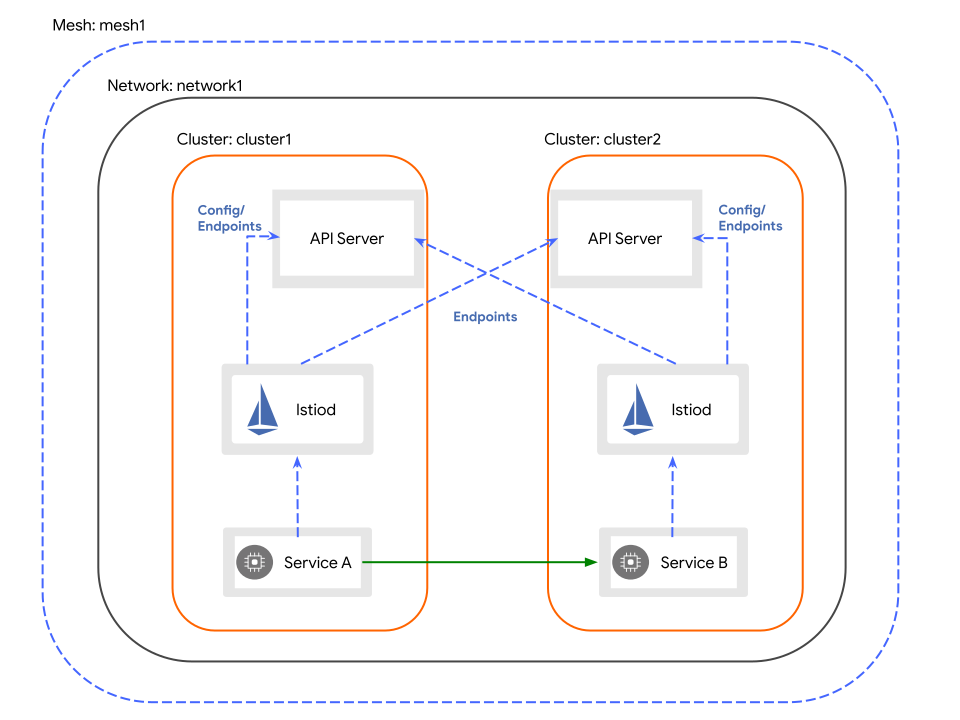

# Architecture

## Multiple Control Planes

The platform deploys the Istio control plane for all clusters in the mesh by creating ServiceMesh resources in the clusters.

Each control plane can independently manage services, gateways, and other resources (ServiceEntry, EnvoyFilter, WASM plugins) deployed in the cluster and can be upgraded separately.

## Independent Fault Domains

Clusters within the mesh are entirely independent, allowing for cross-cloud and cross-region deployments. Each cluster is an independent fault domain.

* A failure in any cluster within the mesh does not affect other clusters.
* Services can be deployed in any cluster within the mesh.
* Services can achieve cross-region disaster recovery and load balancing.

## Single Network / Multi-Network Mode

* **Single Network**: When multiple Kubernetes clusters within the mesh are interconnected and pods in different clusters can access each other via Pod IP, the mesh operates in a single network mode. In this mode, pods can communicate directly without Istio gateways or other components for forwarding.

    

* **Multi-Network**: When clusters within the mesh are not in the same network plane (VPC), pods in different clusters must use Istio gateways to communicate.

    
