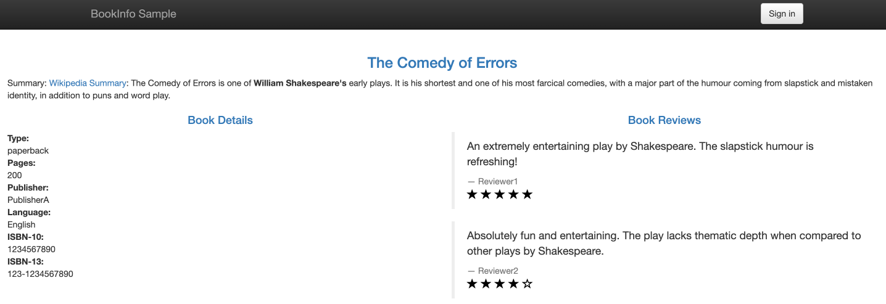

# Deploy the Demo Application Bookinfo

Refer to this document to deploy the Bookinfo application in the same namespace across multiple clusters within the service mesh to validate the capabilities of the multi-cluster service mesh.

## Prepare Projects and Namespaces

Prepare the projects and namespaces for deploying the application, with the following configuration requirements:

* All clusters must be associated with the platform's existing projects as **associated clusters**.
* The same named namespace for deploying the application must exist in all clusters.

    **Note**: Cross-region disaster recovery or load balancing based on the multi-cluster service mesh can only occur between the same named services within the same named namespaces across the clusters within the service mesh.

You can prepare projects and namespaces by following the instructions below:

{/* TODO: [Create a Project](@console-platform-docs/zh/project-usermanual/project/1addproject/) */}

1. Refer to [Create a Project]() to create a project on the platform that includes the **associated clusters** `c1` and `c2`.

{/* TODO: [Create a Namespace](@console-platform-docs/zh/project-usermanual/namespace/1createns/) */}

2. Refer to [Create a Namespace]() to create the same named namespace `ns1` in clusters `c1` and `c2`.

## Deploy the Bookinfo Application in Multiple Clusters

Deploy the Bookinfo application in the same named namespace `ns1` in clusters `c1` and `c2`.

### Prerequisites

You have an image repository accessible by the platform, and you can push images to that repository.

:::note

This document uses Harbor as an example. You need to prepare a project in Harbor for uploading images (with **access level** set to `public`) and assign that project for use by the project prepared for Bookinfo on the platform. You can deploy or integrate the image management tool Harbor on the platform and assign the project for uploading images in Harbor to the project prepared for Bookinfo on the platform.

:::

### Application Introduction

Bookinfo is a sample application provided by Istio that mimics an online bookstore. It consists of four separate services that together provide the functionality of viewing a book's description, book details (ISBN, number of pages, etc.), and some book reviews.

The services that make up Bookinfo are as follows:

| Service Name | Description |
| --- | ----- |
| productpage | Calls the details and reviews services to generate a page. |
| details | Contains information about the book. |
| reviews | Contains reviews of the book and calls the ratings service.<br /><br />The reviews service has three versions:<br />v1: Does not call the ratings service.<br />v2: Calls the ratings service and displays the rating with 1 to 5 stars  .<br />v3: Calls the ratings service and displays the rating with 1 to 5 stars  .<br />**Tip**: The v2 version is deployed by default. |
| ratings | Contains rating information composed of book evaluations. |

The end-to-end architecture of Bookinfo is shown below.


### Prepare Images and YAML Files

Before deploying the Bookinfo application on the platform, you need to download the images and YAML files required for deploying the Bookinfo application from the **Customer Portal** system.

By executing a script, tag the images and upload them to the image repository accessible by the platform, and modify the image addresses in the YAML files accordingly. Ensure that the platform can smoothly pull the required images when deploying the application.

#### **Steps**

1. Log in to the Customer Portal, search for **Bookinfo** in the **Application Marketplace**, and download the provided product files to your local machine.

    :::tip
    For access to the Customer Portal system, please contact technical support.
    :::

2. Open a local terminal and execute the following commands to unzip the downloaded files and load the images.

    ```sh
    unzip <file_name>.zip
    docker load -i images.tar
    ```
    
    :::note
    After unzipping, you will get the following files:
    
    * `images.tar`: The image package of Bookinfo.
    * `bookinfo.yaml`: The YAML file of Bookinfo.
    * `docker_script.sh`: A script for tagging images, uploading images, and modifying the image addresses in the YAML file.
    :::

3. Execute the following command to log in to the image repository accessible by the platform.

    :::note
    Replace `<Harbor address>` with the actual accessible address of Harbor on the platform, for example: `registry-harbor.example.com`.
    :::

    ```sh
    docker login <Harbor address>
    ```
    
    :::note
    If you receive the following error after entering your username and password, modify the **Docker Engine** configuration to add the Harbor address to **insecure-registries**, then re-execute the login command.
    :::

    ```sh
    Error response from daemon: Get "https://<Harbor address>/v2/": http: server gave HTTP response to HTTPS client
    ```

4. Modify the **docker_script.sh** script file.

    Replace `<Harbor address>` with the **Harbor project address** where you want to upload the images, for example: `registry-harbor.example.com/bookinfo`.

5. Execute the following commands sequentially.

    The following commands execute the **docker_script.sh** script to tag the images, upload the images to the Harbor project, and modify the image addresses in the **bookinfo.yaml** file.

    ```sh
    chmod +x docker_script.sh
    ./docker_script.sh
    ```

### One-Click Application Deployment

In the **Container Platform** platform, use YAML to create a **native application** in the namespace `ns1` of clusters `c1` and `c2` to deploy the Bookinfo application.

#### **Steps**

1. In the top navigation bar, click the product view switch to switch to **Container Platform** and enter the namespace `ns1` under cluster `c1`.

2. In the left navigation bar, click **Application Management** > **Native Application**.

3. Click **Create Native Application** and select **One-Click Create with YAML**.

4. Enter the application name, click **Import** in the YAML editor, select **bookinfo.yaml**, and click **Create**.

5. Repeat the above steps to deploy the Bookinfo application in the namespace `ns1` of cluster `c2`.

### Inject Sidecar into the Services of the Application

In the **Service Mesh** platform, add the services `productpage`, `details`, `reviews`, and `ratings` that constitute the Bookinfo application to the Service Mesh platform with **Service Mesh governance mode**. When adding services, the platform automatically injects a Sidecar into the services.

After injecting the Sidecar, the architecture of Bookinfo is shown below.


#### **Steps**

1. In the top navigation bar, click the product view switch to switch to **Service Mesh**.

2. In the left navigation bar, click **Service List**.

3. Click **Add Service** and select **Service Mesh Governance Mode**.

4. Configure the relevant parameters and click **Create**.

    :::note
    Unless otherwise specified, select Deployment and use the default values for the parameters on the interface.
    
    * Repeat the above steps to add the services `productpage`, `details`, `reviews`, and `ratings` to the platform in the namespace `ns1` of clusters `c1` and `c2`.
    :::

## Access the Bookinfo Application via Ingress Gateway

### Steps

Refer to [Using Ingress Gateway](../../trafficmanagement/ingress_gateway/) to deploy the ingress gateway in cluster `c1` and create gateway configuration and routing configuration to access the Bookinfo application deployed in the cluster through a browser.

Configure the relevant parameters as required, and configure other parameters as needed.

* **Ingress Gateway**:
   
    * **Internal Routing Type**: `LoadBalancer`.
    
    * Port includes HTTP protocol port.

* **Gateway Configuration**: Select the port with the HTTP protocol.

* **Routing Configuration**: **Routing Destination** selects `namespace ns1 in cluster c1`, `internal routing productpage`, and port `9080`.

### Access Verification

Click the **External Access Address** in the routing configuration, select the type of simulated user (**Normal user/Test user**) at the bottom left of the opened page, then you can access the `productpage` service and see the rating information displayed by the version of the `reviews` service called by the `productpage` service.



The service call topology is shown below.

