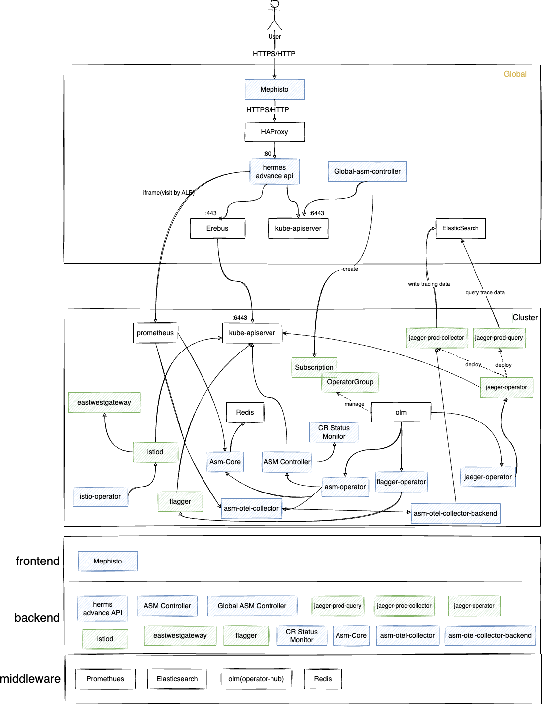

# Architecture

| Component Name                     | Location                                  | Description                                                                 |
|------------------------------------|-------------------------------------------|-----------------------------------------------------------------------------|
| mephisto              | global                                         | Service mesh business view                                                   |
| hermes                       | global                                         | Web service providing advanced APIs for frontend display                    |
| global-asm-controller        | global                                         | Create/update/upgrade/uninstall ASM service mesh                            |
| asm-controller    | Cluster                                         | Business CRD status maintenance, webhook implementation                     |
| asm-core                 | Cluster                                     | Ratelimit
| asm-otel-collector-backend                | Cluster                                         | Collects and processes tracing data from Otel Java agents                   |
| asm-otel-collector                | Cluster                                         | loadbalancer of asm-otel-collector-backend                    |
| asm-cr-status   | Cluster                                        | Monitors deployment status of various components                            |
| asm-operator                    | Cluster  | Deploys ASM business components                                             |
| flagger-operator                   | Cluster                                         | Deploys flagger components                                                  |
| istio-operator                     | Cluster                                        | Deploys Istio components                                                    |
| jaeger-operator                    | Cluster                                         | Deploys Jaeger components                                                   |
| flagger    | Cluster                                         | Automated canary releases                                                   |
| istiod              | Cluster                                         | Manages sidecar policies, traffic governance, security, and observability   |
| jaeger-prod-collector                   | Cluster                                         | Collects tracing data from mesh and Otel microservices                     |
| jaeger-prod-query                       | Cluster                                         | Queries tracing data from mesh and Otel microservices                      |
