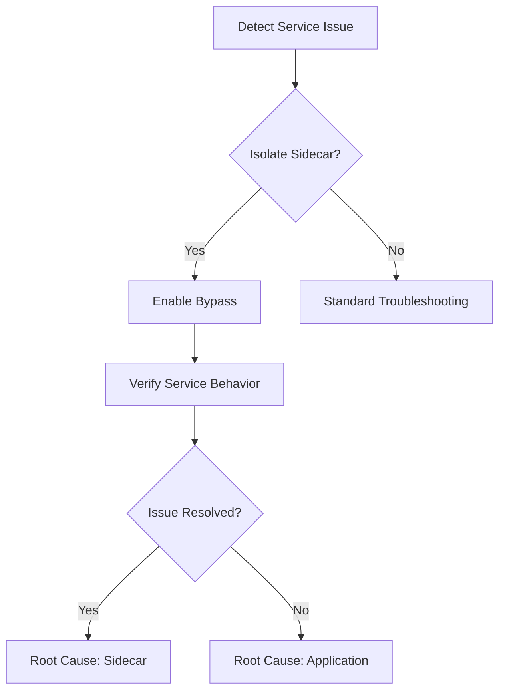
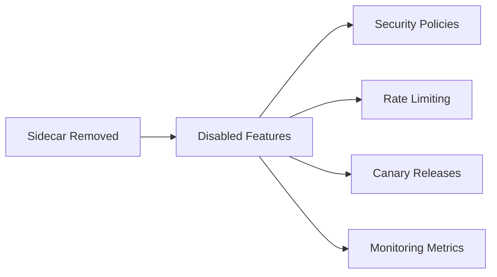

# Advanced Sidecar Operations

## Introduction  
Advanced Sidecar Operations provide granular control over Istio proxy behavior within service meshes. This functionality:

- Optimizes network performance through targeted traffic handling  
- Enables non-disruptive debugging and troubleshooting  
- Offers emergency bypass capabilities  
- Maintains operational flexibility in complex environments  

Core value: Enhanced observability and control over service mesh components  

## Features  
- Traffic passthrough configuration  
- Pod-level bypass mode  
- Dynamic log level adjustment  
- Full Sidecar removal  

## Traffic Passthrough Configuration

### Configuration Parameters  
| Parameter | Type | Description |  
|-----------|------|-------------|  
| Destination Port | Outbound | Target service port (e.g., 6379) |  
| IP Segment | Outbound | CIDR notation (e.g., 10.0.0.0/8) |  
| Container Port | Inbound | Service's exposed port (e.g., 8080) |  

### Implementation Steps  
1. Navigate: **Service List** > **Target Service**  
2. Select **Details** > **Sidecar Configuration**  
3. Configure passthrough rules:  
   - Add outbound ports/IP ranges  
   - Specify inbound container ports  
4. Confirm Deployment restart  

**Note**: Triggers full Deployment restart - plan maintenance window  

## Bypass Mode Management

### Operational Workflow  


### Execution Steps  
1. Locate target Pod: **Pods** tab  
2. Activate bypass:  > **Bypass Mode**  
3. Toggle switch ➔ **OK**  
4. Restart Istiod component (admin required)  

**Requirements**:  
- Kubernetes ≥v1.23  
- Pod in Running state  
- No pending Sidecar updates  

## Sidecar Log Control

### Log Levels  
| Level | Persistence | Use Case |  
|-------|-------------|----------|  
| trace | Temporary | Protocol-level debugging |  
| debug | Both | Connection issues |  
| info | Permanent | Production monitoring |  

### Update Process  
1. Access service details  
2. Click   
3. Select level and mode:  
   ```yaml
   logLevel: debug
   persistence: temporary
   ```  
4. Confirm update  

**Cluster Sync**: Automatically propagates to multi-cluster deployments  

## Sidecar Removal

### Impact Analysis  


### Removal Procedure  
1. Verify no active canary releases  
2. Execute **Actions** > **Remove Sidecar**  
3. Confirm operation:  
   ```bash
   kubectl delete sidecar <service-name>
   ```  

**Recovery**: Requires re-injection through service mesh configuration  
