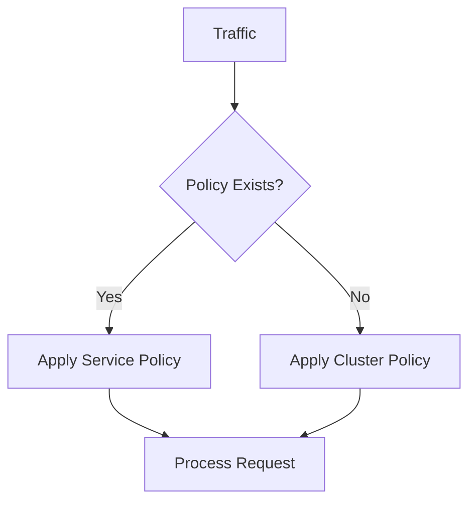

# Service Governance Policies

## Introduction
Service Governance Policies enable precise control over service-to-service communication through Istio's DestinationRule configurations. These policies address:

- Preventing cascading service failures
- Optimizing resource distribution
- Managing high-traffic scenarios
- Ensuring session consistency

Core value: Maintain service stability and performance under varying loads

## Features
- Circuit breaker with multi-level isolation
- Four load balancing algorithms
- Protocol-specific connection limits
- Cluster-wide and service-specific policies

## Advantages
**Fault Tolerance**: Automatic pod isolation on errors
**Flexibility**: Multiple load balancing strategies
**Protection**: Connection throttling mechanisms
**Priority Control**: Service-level override capability

## Circuit Breaker Policy

### Policy Parameters
| Parameter | Description | Constraints |
|-----------|-------------|-------------|
| Consecutive 5xx Errors | 5 consecutive errors trigger isolation | ≥1 |
| Check Interval | Health check frequency | 30s default |
| Base Isolation Time | Initial isolation duration | 30s minimum |
| Max Ejection Percent | Maximum isolated pods ratio | 50% maximum |

### Configuration Workflow
1. **Cluster-Level**:
   - Navigate: **Service Mesh** > **Meshes** > **Mesh Policies**
   - Create policy affecting all cluster services

2. **Service-Level**:
   - Navigate: **Service List** > **Target Service** > **Policies**
   - Create overriding policy

**Priority**: Service policies > Cluster policies

## Load Balancing Strategies

### Algorithm Types
| Type | Selection Method | Use Case |
|------|------------------|----------|
| Least Request | Choose from 2 least busy pods | High concurrency |
| Random | Random selection | Simple distribution |
| Round Robin | Sequential allocation | Equal utilization |
| Session Affinity | Consistent hashing | Stateful apps |

### Session Persistence Options
```yaml
sessionAffinity:
  httpHeaderName: "User-Agent"
  httpCookie:
    name: "sessionID"
    ttl: "3600s"
```

| Method | Configuration |
|--------|---------------|
| Header | Custom header name |
| Source IP | true/false toggle |
| Cookie | Name/Path/TTL |

**Note**: Disables regional load balancing when enabled

## Connection Pool Management

### HTTP/HTTP2 Parameters
| Parameter | Default | Description |
|-----------|---------|-------------|
| Max Connections | 1024 | Simultaneous connections per pod |
| Max Requests | 1024 | HTTP2 concurrent requests |
| Max Retries | 3 | Retry attempts limit |

### TCP Parameters
| Parameter | Default | Description |
|-----------|---------|-------------|
| Connection Timeout | 30s | TCP handshake timeout |
| Max Connections | 1024 | Active TCP connections |

### Configuration Steps
1. Access service details
2. Navigate to **Policies** tab
3. Select protocol type (HTTP/TCP)
4. Set connection limits

## Operational Constraints
1. **Circuit Breaker**:
   - Requires ≥2 healthy pods for effectiveness
   - Service-specific policies override cluster settings

2. **Load Balancing**:
   - LEAST_REQUEST default strategy
   - Session affinity incompatible with regional load

3. **Connection Pool**:
   - Parameters apply per client pod
   - HTTP 1.1 max pending requests: 1024

## Policy Hierarchy



