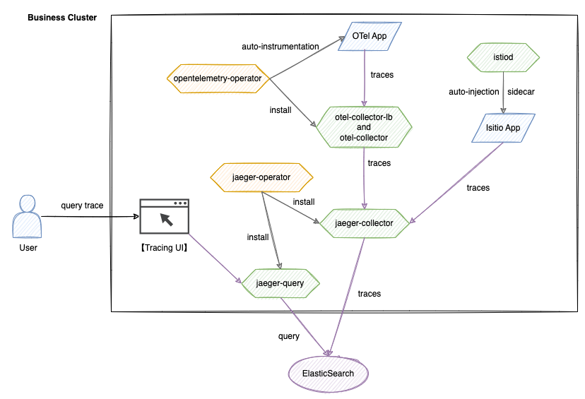

# Архитектура

Эта архитектура построена на технологиях Istio, OpenTelemetry и Jaeger, обеспечивая управление полным жизненным циклом распределенного трассирования. Система состоит из пяти основных модулей: сбора данных, передачи, хранения, запросов и визуализации.

## Основные компоненты

1. **Система Istio**
   - **istio-proxy**\
     Прокси-сервис, который автоматически захватывает и генерирует данные трассировки для связи между сервисами без изменения кода.
   - **istiod**\
     Управляет конфигурацией и жизненным циклом istio-proxy, включая конфигурацию трассировки для сервисной сетки.

2. **Система OpenTelemetry**
   - **opentelemetry-operator**\
     Оператор на уровне кластера, отвечающий за развертывание и управление компонентом otel-collector, обеспечивая автоматическую инъекцию OTel.
   - **otel-collector**\
     Принимает данные трассировки от приложений, фильтрует и группирует их, а затем перенаправляет на jaeger-collector.
   - **Интерфейс визуализации трассировки**\
     Самостоятельно разработанный визуализирующий интерфейс, интегрирующийся с API jaeger-query, поддерживает многомерные условия запросов.

3. **Система Jaeger**
   - **jaeger-operator**\
     Разворачивает и управляет компонентами jaeger-collector и jaeger-query.
   - **jaeger-collector**\
     Принимает данные трассировки, перенаправленные и обработанные otel-collector, выполняет преобразование форматов и записывает их в Elasticsearch.
   - **jaeger-query**\
     Предоставляет API для запросов трассировки, поддерживает многоусловный поиск, включая TraceID и метки.

4. **Уровень хранения**
   - **Elasticsearch**\
     Распределенный движок хранения, поддерживающий эффективную запись и извлечение большого объема данных Span.

## Поток данных

- **Процесс записи Istio**\
  `Приложение -> jaeger-collector -> Elasticsearch`

  Istio-proxy автоматически захватывает данные трассировки от связи между сервисами, которые затем отправляются напрямую на jaeger-collector для сохранения в Elasticsearch.

- **Процесс записи OpenTelemetry**\
  `Приложение -> otel-collector -> jaeger-collector -> Elasticsearch`

  Приложение генерирует данные Span через SDK или автоматическую инъекцию, которые стандартизируются otel-collector, а затем сохраняются в Elasticsearch jaeger-collector.

- **Процесс запроса**\
  `Пользователь -> Интерфейс визуализации трассировки -> jaeger-query -> Elasticsearch`

  Пользователь отправляет условия запроса через интерфейс, а jaeger-query извлекает данные из Elasticsearch; интерфейс визуализирует результаты на основе возвращаемых данных.
