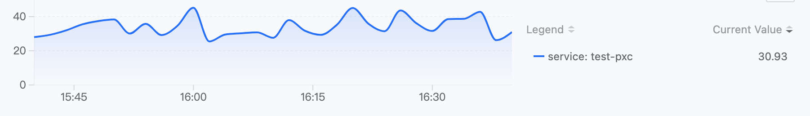
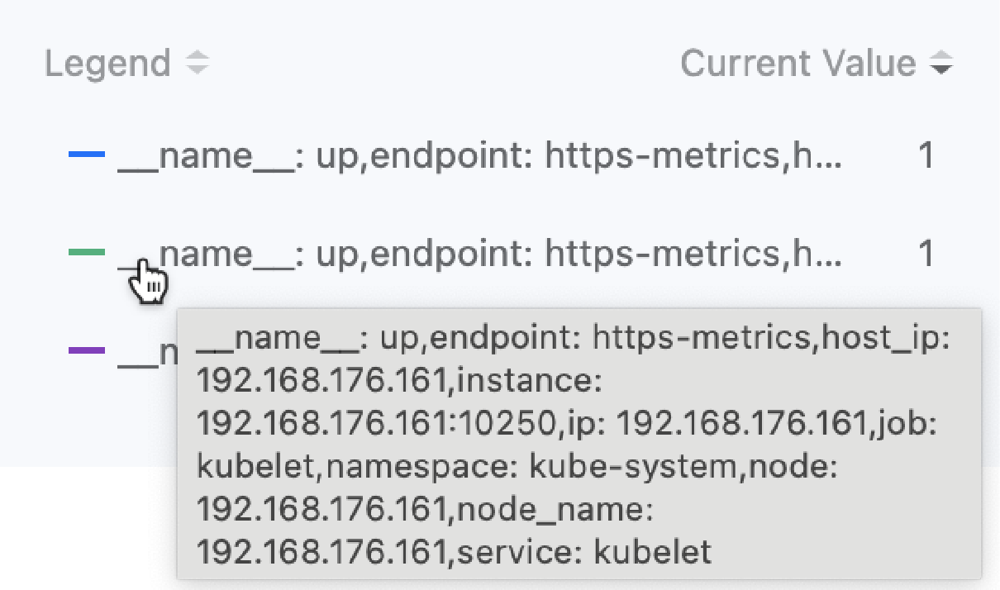

# Политики оповещения

Вы можете самостоятельно создать пользовательскую политику оповещения на платформе ASM, или вы можете быстро создать одну, используя шаблон, предоставленный администратором в управлении платформой.

## Создание персонализированных политик оповещения

На основе данных мониторинга, журналов и событий платформы, в сочетании с функцией уведомлений платформы, создавайте метрики оповещения, пользовательские оповещения, оповещения по журналам и типы оповещений о событиях для сервисов и вычислительных компонентов в одной и той же области имен в текущей сетевой службе. Когда ресурсы, на которые направлена политика оповещения, испытывают аномалии или данные мониторинга достигают предопределенного состояния предупреждения, оповещения автоматически срабатывают, и отправляются уведомления.

### Предварительные условия

- Если вам нужно, чтобы конфигурация оповещения автоматически уведомляла, пожалуйста, заранее свяжитесь с администратором платформы, чтобы настроить **Политику уведомлений** в представлении **Управление платформой**.

- Убедитесь, что кластер, в котором находятся ресурсы политики оповещения, имеет развернутый компонентов мониторинга, чтобы созданные на основе мониторинговых метрик политики оповещения могли вступить в силу.

- Убедитесь, что кластер, в котором находятся ресурсы политики оповещения, имеет установленный компонент Elasticsearch, чтобы созданные на основе журналов и результатов запросов событий политики оповещения могли действовать.

### Быстрый старт

1. В левой навигационной панели нажмите **Оповещения** > **Правила**.

2. Нажмите **Создать правило**.

### Основная информация

В области **Основная информация** настройте основную информацию о политике оповещения. Вам нужно сначала выбрать различные типы оповещений.

**Ресурсные оповещения**

Типы оповещений, разделенные по категориям мониторинга ресурсов, например, следующие два сценария:

1. Вы можете непрерывно отслеживать некоторые или все развертывания в текущей области имен и вызывать оповещение, когда их статус развертывания не "Работает".
2. Вы можете непрерывно отслеживать конкретный микросервис в текущей области имен и вызывать оповещение, когда уровень ошибок трафика сервиса превышает 20%.

Советы:

- Если в объекте ресурса не выбраны соответствующие параметры, по умолчанию устанавливается **Любой**. Последующее **удаление/добавление** объектов ресурсов будет **разрывать/автоматически связывать** политику оповещения.
- **Сервисы** являются необязательными и могут быть также указаны путем ввода и нажатия Enter. При вводе поддерживаются регулярные выражения для имен сервисов, такие как `cert.*`.

**Оповещения по событиям**

Типы оповещений, разделенные на основе событий K8s, например, следующий сценарий:

Для Pod с именем Nginx в текущей области имен, после добавления правила сопоставления оповещение может быть вызвано, когда статус Pod будет "Неудача".

Совет: Если в правилах сопоставления ничего не выбрано, оно будет выбирать все ресурсы под некоторым ресурсом, а последующее **удаление/добавление** ресурсов будет **разрывать/автоматически связывать** политику оповещения.

**Быстрые советы**

Если вы ожидаете непрерывного мониторинга сервиса OpenTelemetry, пожалуйста, выберите **Ресурсные оповещения** и выберите метод управления как **OpenTelemetry**.

### Правила оповещения

Как только вы выбрали тип оповещения и установили диапазон мониторинга на основе вышеприведенных инструкций, вы можете добавить соответствующие правила оповещения.

#### **Ресурсные оповещения**

1. В области **Правила** нажмите **Добавить правило оповещения**.

   **Примечание**: График мониторинга, отображаемый над диалоговым окном, предоставляет предварительный просмотр данных мониторинговых метрик или выражений, которые изменяются в реальном времени на основе вашего выбора. Вы можете снова подтвердить свой ввод на основе графика.

   

2. Выберите тип оповещения и обратитесь к следующими инструкциями для настройки правил оповещения.

**Метрик оповещения**: выберите метрики оповещения, предустановленные платформой.

**Пользовательские оповещения**

Пожалуйста, обратитесь к инструкции ниже, чтобы ввести соответствующие данные:

- Имя метрики: введите имя текущей пользовательской метрики для облегчения управления и поиска.
- Выражение: вам нужно добавить специфическое правило метрики в соответствии с вашим сценарием мониторинга, чтобы удовлетворить потребности в продвинутом мониторинге и оповещениях. Понадобится ручной ввод метрик, распознаваемых Prometheus, и мониторинговых выражений, таких как: `rate(node_network_receive_bytes{instance="$server",device!~"lo"}[5m])`.
- Единица: единица измерения мониторинговой метрики, которая может быть вручную введена в качестве пользовательской единицы.
- Параметры легенды: чтобы упростить отображение и просмотр данных по легенде, вы можете ввести метку мониторинговых данных в качестве **ключа**, а `value`, соответствующий ключу, будет служить идентификатором легенды. Формат ввода: `{{.key}}`.

**Инструкции по настройке параметров легенды**: после ввода правильного выражения переместите курсор в список статистики ранжирования справа от графика мониторинга над диалоговым окном, чтобы просмотреть все метки данных. Как показано на рисунке.

Например: Метки мониторинговых данных, полученных через выражение `up{service="kubelet"}`, включают `"__name__":"up","endpoint":"https-metrics","instance":"192.168.18.2:10250","job":"kubelet","namespace":"kube-system","node":"192.168.18.2","service":"kubelet"`. Если вы хотите использовать целевой конечный пункт, который собирает данные, в качестве идентификатора легенды, вы можете ввести параметр легенды `{{.instance}}`. Эффект отображения показан на следующем рисунке.

3. Введите условия срабатывания

**Условие срабатывания** состоит из операторов сравнения, порогов оповещения и времени задержки (по желанию). Результат сравнения между реальным значением/количеством журналов/количеством событий мониторинговых метрик и порогом оповещения, а также время, в течение которого реальное значение остается в диапазоне порога оповещения, определяет, следует ли вызывать оповещение.

**Операторы сравнения**: **>** (больше), **>=** (больше или равно), **==** (равно), **\<=** (меньше или равно), **\<** (меньше), **!=** (не равно).

**Порог**: порог оповещения принимает только числа. Когда **метод обнаружения** выбранного черного ящика "HTTP", а **имя метрики** выбрано как `cluster.blackbox.http.status.code`, порог оповещения - это код состояния ответа HTTP-запроса, поддерживающий ввод только положительно целого числа из трех цифр, например: 200.

**Время задержки**: время, в течение которого реальное значение данных метрики остается в диапазоне порога оповещения. Когда время задержки равно заданному времени, вызывается оповещение.

4. Выберите уровень оповещения

Уровень оповещения правила оповещения, устанавливаемый пользователем, позволяет пользователям установить разумный уровень оповещения в зависимости от влияния соответствующих ресурсов правила оповещения на бизнес-операции.

**Критический**: сбой соответствующего ресурса правила оповещения приводит к остановке бизнес-платформы, потере данных и значительному влиянию. Например: Значение статуса здоровья узла равно 0 (нерабочее) в течение 3 минут.

**Высокий**: соответствующий ресурс правила оповещения имеет известные проблемы, которые могут вызвать функциональные сбои платформы, влияя на нормальное выполнение бизнеса. Например: ситуация, когда количество доступных групп Pod для вычислительного компонента равно 0, длится 3 минуты.

**Средний**: соответствующий ресурс правила оповещения имеет операционные риски. Если не решить это вовремя, это может отрицательно сказаться на нормальном ведении бизнеса. Например: ситуация, когда использование процессора узла превышает 80%, длится 3 минуты.

**Низкий**: соответствующий ресурс правила оповещения имеет ожидаемые проблемы, которые не влияют на бизнес-операции в краткосрочной перспективе, но существуют потенциальные риски. Например: ситуация, когда использование процессора узла превышает 70%, длится 3 минуты.

5. Нажмите **Добавить**.

#### **Оповещения по событиям**

1. После выбора **Оповещений по событиям** в качестве типа оповещения в области **Правила** нажмите **Добавить правило оповещения**.

2. Выберите диапазон времени. Например: Если диапазон времени установлен на 5 минут, после создания оповещения, если количество событий, которые соответствуют условиям, будет достигнуто в любое 5-минутное время, будет вызвано оповещение.

3. Элементы мониторинга событий
   Мониторинг уровня событий или причины событий выбранных событий.

- **Серьезность события**: уровень серьезности, определенный для выбранного события, например, Предупреждение.
- **Причина события**: конкретная причина события (Причина, например, BackOff, Pulling, Failed и т.д.), подтвердите, нажав клавишу Enter. Можно ввести несколько полей, а во время запроса связь между несколькими полями - это `или`, что означает, что записи, содержащие любое из указанных причин событий, соответствуют критериям запроса.

4. Условия срабатывания

   Условия срабатывания используют операторы сравнения, чтобы определить, следует ли вызывать оповещение на основе результатов сравнения количества записей событий.

5. Уровень оповещения

   Уровень оповещения правила оповещения, устанавливаемый пользователем, позволяет пользователям установить разумный уровень оповещения в зависимости от влияния соответствующих ресурсов правила оповещения на бизнес-операции.

   **Критический**: сбой соответствующего ресурса правила оповещения приводит к остановке бизнес-платформы, потере данных и значительному влиянию. Например: Значение статуса здоровья узла равно 0 (нерабочее) в течение 3 минут.

   **Высокий**: соответствующий ресурс правила оповещения имеет известные проблемы, которые могут вызвать функциональные сбои платформы, влияя на нормальное выполнение бизнеса. Например: ситуация, когда количество доступных групп Pod для вычислительного компонента равно 0, длится 3 минуты.

   **Средний**: соответствующий ресурс правила оповещения имеет операционные риски. Если не решить это вовремя, это может отрицательно сказаться на нормальном ведении бизнеса. Например: ситуация, когда использование процессора узла превышает 80%, длится 3 минуты.

   **Низкий**: соответствующий ресурс правила оповещения имеет ожидаемые проблемы, которые не влияют на бизнес-операции в краткосрочной перспективе, но существуют потенциальные риски. Например: ситуация, когда использование процессора узла превышает 70%, длится 3 минуты.

6. Нажмите **Добавить**.

#### **Проверка результата**

Неважно, выберете ли вы пользовательские оповещения или события, после добавления всплывающее окно закрывается, и добавленные вами записи отображаются в списке **Правил** на странице создания политики оповещения.

### Настройка политики уведомлений (по желанию)

Если вы уже создали политику уведомлений на странице управления, вы можете установить действия уведомления после активации оповещения в области **Настройки политики**.

1. Нажмите раскрывающееся меню **Политика уведомлений** и выберите одну или несколько политик уведомлений, которые были созданы на платформе.

2. Выберите **Интервал уведомлений об оповещениях**, настройте интервал отправки уведомлений об оповещениях с момента срабатывания оповещения до его возвращения к норме.

- **Глобальный**: выберите использование глобальной настройки по умолчанию платформы. Глобальные настройки поддерживают обновления.

- **Пользовательский**: после выбора **Пользовательский** вы можете настроить интервал отправки уведомлений об оповещениях, нажав на раскрывающееся меню рядом с уровнем оповещения. **Примечание**: При выборе **Без повторений** отправляется только одно уведомление об оповещении, когда оповещение срабатывает и когда оно возвращается к норме.

### Завершение

После подтверждения правильности введенной информации нажмите **Создать**, чтобы завершить операцию. Вы можете управлять и просматривать текущее состояние каждой политики (например, было ли вызвано оповещение) в списке политик оповещения.

## Создание политик оповещения с использованием шаблонов политик оповещения

Используйте шаблоны оповещений, созданные на платформе, чтобы быстро создать политики оповещения для определенных вычислительных компонентов.

### Предварительные условия

- Администраторы создали шаблоны оповещений для вычислительных компонентов на платформе (**Представление управления платформой > Центр операций > Оповещения > Шаблоны оповещения**).

- Убедитесь, что кластер, в котором находятся ресурсы политики оповещения, имеет установленный компонент мониторинга, чтобы созданные на основе мониторинговых метрик политики оповещения могли вступить в силу.

- Убедитесь, что кластер, в котором находятся ресурсы политики оповещения, имеет установленный компонент Elasticsearch, чтобы созданные на основе журналов и результатов запросов событий политики оповещения могли действовать.

### Шаги

1. В левой навигационной панели нажмите **Оповещения** > **Правила**.
2. Нажмите  рядом с кнопкой **Создать правило** > **Из шаблона**.
3. Настройте основную информацию о политике оповещения и выберите **Объект ресурса** и **Принадлежащий кластер**.
4. Нажмите **Создать**.

## Последующие действия

### Просмотр актуальных оповещений

Вы можете просмотреть текущее состояние оповещения политик оповещения, которые вы создали, в списке политик оповещения.

Кроме того, чтобы обеспечить более четкое отображение текущей ситуации с оповещениями, платформа предлагает функцию панели **Актуальные оповещения**, которая централизует отображение ресурсов, которые в настоящее время подвергаются оповещениям, уровень воздействия оповещений и подробную информацию об оповещениях в кластерах под текущей сетевой службой, для которой у вас есть разрешения. Это облегчает операционному персоналу и разработчикам получение актуального обзора общей ситуации с оповещениями на платформе, быстрое реагирование на причины неполадок и обеспечение нормальной работы платформы.

### Отключение/включение правил оповещения

Чтобы упростить гибкое управление правилами под политикой, поддерживается возможность отключения/включения правил в созданных политиках оповещения. При отключении статус правила становится `-`, и правило не учитывается в общем количестве правил политики оповещения; когда правило снова включается, условия, необходимые для срабатывания оповещения, содержащиеся в условии, снова вступают в силу.

**Шаги**

1. В левой навигационной панели нажмите **Оповещения** > **Правила**.

2. Нажмите ***Имя*** управляемого правила.

3. В области **Условия оповещения** нажмите переключатель **Отключить/Включить** рядом с правилом, которое необходимо отключить/включить.
