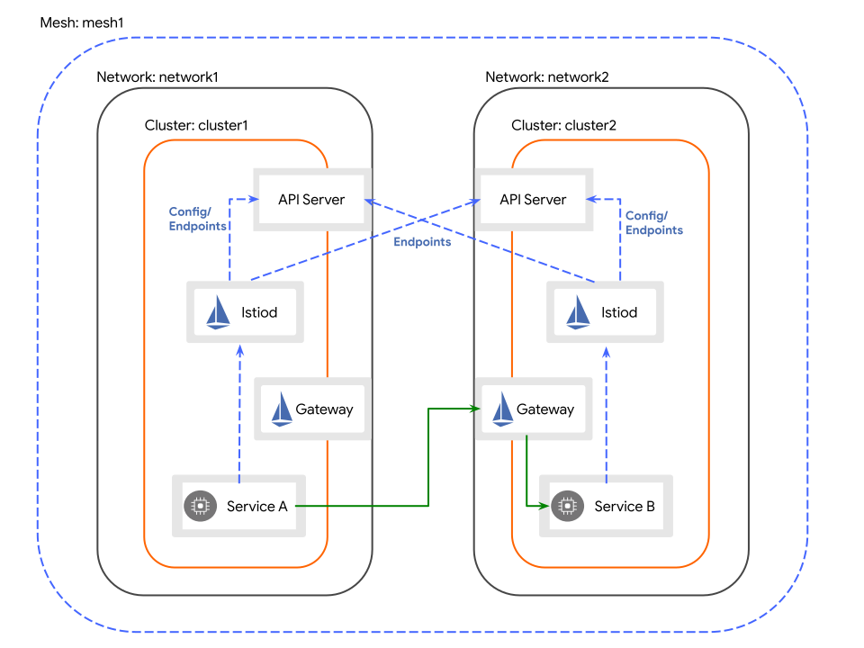

# Архитектура

## Несколько управляющих плоскостей

Платформа развертывает управляющую плоскость Istio для всех кластеров в сетке, создавая ресурсы ServiceMesh в кластерах.

Каждая управляющая плоскость может независимо управлять службами, шлюзами и другими ресурсами (ServiceEntry, EnvoyFilter, плагины WASM), развернутыми в кластере, и может обновляться отдельно.

## Независимые домены отказа

Кластеры в пределах сетки полностью независимы, что позволяет развертывать их в разных облаках и регионах. Каждый кластер является независимым доменом отказа.

- Отказ в любом кластере в пределах сетки не влияет на другие кластеры.
- Службы могут быть развернуты в любом кластере в пределах сетки.
- Службы могут достичь восстановления после катастроф в разных регионах и балансировки нагрузки.

## Режим единой сети / многофункциональной сети

- **Единая сеть**: Когда несколько кластеров Kubernetes в сетке взаимосвязаны, и поды в разных кластерах могут взаимодействовать друг с другом через IP-адреса подов, сетка работает в режиме единой сети. В этом режиме поды могут напрямую общаться без шлюзов Istio или других компонентов для передачи.

  

- **Многофункциональная сеть**: Когда кластеры в пределах сетки находятся не в одной и той же сетевой плоскости (VPC), поды в разных кластерах должны использовать шлюзы Istio для общения.

  
