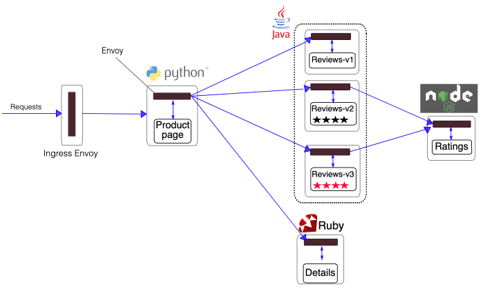

# Развертывание демонстрационного приложения Bookinfo

Ссылайтесь на этот документ, чтобы развернуть приложение Bookinfo в одном и том же пространстве имен в нескольких кластерах в рамках сервисной сетки, чтобы подтвердить возможности мульти-кластерной сервисной сетки.

## Подготовка проектов и пространств имен

Подготовьте проекты и пространства имен для развертывания приложения с следующими требованиями к конфигурации:

- Все кластеры должны быть связаны с существующими проектами платформы как **связанные кластеры**.
- Одно и то же пространство имен для развертывания приложения должно существовать во всех кластерах.

  **Примечание**: Восстановление после катастроф в разных регионах или балансировка нагрузки на основе мульти-кластерной сервисной сетки может происходить только между одноименными сервисами в одноименном пространстве имен в кластерах внутри сервисной сетки.

Вы можете подготовить проекты и пространства имен, следуя приведенным ниже инструкциям:

{/* TODO: [Создать проект](@console-platform-docs/zh/project-usermanual/project/1addproject/) */}

1. Ссылайтесь на [Создать проект]() для создания проекта на платформе, который включает **связанные кластеры** `c1` и `c2`.

{/* TODO: [Создать пространство имен](@console-platform-docs/zh/project-usermanual/namespace/1createns/) */}

2. Ссылайтесь на [Создать пространство имен]() для создания одноименного пространства имен `ns1` в кластерах `c1` и `c2`.

## Развертывание приложения Bookinfo в нескольких кластерах

Разверните приложение Bookinfo в одноименном пространстве имен `ns1` в кластерах `c1` и `c2`.

### Предварительные условия

У вас есть репозиторий изображений, доступный для платформы, и вы можете загружать изображения в этот репозиторий.

:::note

В этом документе используется Harbor в качестве примера. Вам необходимо подготовить проект в Harbor для загрузки изображений (с **уровнем доступа** установленным на `public`) и назначить этот проект для использования проектом, подготовленным для Bookinfo на платформе. Вы можете развернуть или интегрировать инструмент управления изображениями Harbor на платформе и назначить проект для загрузки изображений в Harbor проекту, подготовленному для Bookinfo на платформе.

:::

### Введение в приложение

Bookinfo — это демонстрационное приложение, предоставляемое Istio, которое имитирует онлайн-книжный магазин. Оно состоит из четырех отдельных сервисов, которые вместе предоставляют функциональность просмотра описания книги, ее деталей (ISBN, количество страниц и т.д.) и некоторых отзывов о книге.

Сервисы, из которых состоит Bookinfo, следующие:

| Название услуги | Описание                                                                                                                                                                                                                                                                                                                                                                                                                                                                                                                                                                                                                 |
| --------------- | --------------------------------------------------------------------------------------------------------------------------------------------------------------------------------------------------------------------------------------------------------------------------------------------------------------------------------------------------------------------------------------------------------------------------------------------------------------------------------------------------------------------------------------------------------------------------------------------------------------------------- |
| productpage     | Вызывает сервисы деталей и отзывов для генерации страницы.                                                                                                                                                                                                                                                                                                                                                                                                                                                                                                                                                                 |
| details         | Содержит информацию о книге.                                                                                                                                                                                                                                                                                                                                                                                                                                                                                                                                                                                        |
| reviews         | Содержит отзывы о книге и вызывает сервис рейтингов.<br /><br />Сервис отзывов имеет три версии:<br />v1: Не вызывает сервис рейтингов.<br />v2: Вызывает сервис рейтингов и отображает рейтинг от 1 до 5 звезд  .<br />v3: Вызывает сервис рейтингов и отображает рейтинг от 1 до 5 звезд  .<br />**Совет**: Версия v2 развернута по умолчанию. |
| ratings         | Содержит информацию о рейтингах, состоящую из оценок книг.                                                                                                                                                                                                                                                                                                                                                                                                                                                                                                                                                                   |

Конечная архитектура Bookinfo показана ниже.


### Подготовка изображений и YAML файлов

Перед развертыванием приложения Bookinfo на платформе вам необходимо загрузить изображения и YAML файлы, необходимые для развертывания приложения Bookinfo из системы **Портал клиента**.

Запустив скрипт, пометьте изображения и загрузите их в репозиторий изображений, доступный для платформы, и измените адреса изображений в YAML файлах соответственно. Убедитесь, что платформа может без проблем загрузить необходимые изображения при развертывании приложения.

#### **Шаги**

1. Войдите в Портал клиента, найдите **Bookinfo** в **Маркетплейсе приложений** и загрузите предоставленные файлы продукта на свой локальный компьютер.

   :::tip
   Для доступа к системе Портал клиента, пожалуйста, свяжитесь с технической поддержкой.
   :::

2. Откройте локальный терминал и выполните следующие команды для распаковки загруженных файлов и загрузки изображений.

   ```sh
   unzip <file_name>.zip
   docker load -i images.tar
   ```

   :::note
   После распаковки вы получите следующие файлы:

   - `images.tar`: Пакет изображений Bookinfo.
   - `bookinfo.yaml`: YAML файл для Bookinfo.
   - `docker_script.sh`: Скрипт для пометки изображений, загрузки изображений и изменения адресов изображений в YAML файле.
     :::

3. Выполните следующую команду для входа в репозиторий изображений, доступный для платформы.

   :::note
   Замените `<Harbor address>` на фактический доступный адрес Harbor на платформе, например: `registry-harbor.example.com`.
   :::

   ```sh
   docker login <Harbor address>
   ```

   :::note
   Если вы получили следующую ошибку после ввода своего имени пользователя и пароля, измените конфигурацию **Docker Engine**, добавив адрес Harbor в **insecure-registries**, затем повторно выполните команду входа.
   :::

   ```sh
   Error response from daemon: Get "https://<Harbor address>/v2/": http: server gave HTTP response to HTTPS client
   ```

4. Измените файл скрипта **docker_script.sh**.

   Замените `<Harbor address>` на **адрес проекта Harbor**, в который вы хотите загрузить изображения, например: `registry-harbor.example.com/bookinfo`.

5. Выполните следующие команды по порядку.

   Следующие команды выполняют скрипт **docker_script.sh** для пометки изображений, загрузки изображений в проект Harbor и изменения адресов изображений в файле **bookinfo.yaml**.

   ```sh
   chmod +x docker_script.sh
   ./docker_script.sh
   ```

### Развертывание приложения с одним кликом

На платформе **Container Platform** используйте YAML для создания **родного приложения** в пространстве имен `ns1` кластеров `c1` и `c2` для развертывания приложения Bookinfo.

#### **Шаги**

1. В верхней навигационной строке нажмите переключатель вида продукта, чтобы переключиться на **Container Platform** и войти в пространство имен `ns1` под кластером `c1`.

2. В левой навигационной строке нажмите **Управление приложениями** > **Родное приложение**.

3. Нажмите **Создать родное приложение** и выберите **Создать с одним кликом с использованием YAML**.

4. Введите название приложения, нажмите **Импорт** в редакторе YAML, выберите **bookinfo.yaml** и нажмите **Создать**.

5. Повторите приведенные выше шаги для развертывания приложения Bookinfo в пространстве имен `ns1` кластера `c2`.

### Инъекция сайдкара в сервисы приложения

На платформе **Service Mesh** добавьте сервисы `productpage`, `details`, `reviews` и `ratings`, составляющие приложение Bookinfo, на платформу Service Mesh в режиме управления сервисами **Service Mesh**. При добавлении сервисов платформа автоматически инжектирует сайдкар в сервисы.

После инъекции сайдкара архитектура Bookinfo показана ниже.



#### **Шаги**

1. В верхней навигационной строке нажмите переключатель вида продукта, чтобы переключиться на **Service Mesh**.

2. В левой навигационной строке нажмите **Список сервисов**.

3. Нажмите **Добавить сервис** и выберите **Режим управления сервисами Service Mesh**.

4. Настройте соответствующие параметры и нажмите **Создать**.

   :::note
   Если не указано иное, выберите Развертывание и используйте значения по умолчанию для параметров на интерфейсе.

   - Повторите приведенные выше шаги для добавления сервисов `productpage`, `details`, `reviews` и `ratings` на платформу в пространстве имен `ns1` кластеров `c1` и `c2`.
     :::

## Доступ к приложению Bookinfo через Ingress Gateway

### Шаги

Ссылайтесь на [Использование Ingress Gateway](../../trafficmanagement/ingress_gateway/) для развертывания входного шлюза в кластере `c1` и создания конфигурации шлюза и конфигурации маршрутизации для доступа к приложению Bookinfo, развернутому в кластере, через браузер.

Настройте соответствующие параметры по мере необходимости и настройте другие параметры по мере необходимости.

- **Ingress Gateway**:

  - **Тип внутренней маршрутизации**: `LoadBalancer`.

  - Порт включает порт протокола HTTP.

- **Конфигурация шлюза**: выберите порт с протоколом HTTP.

- **Конфигурация маршрутизации**: **Маршрутизация назначения** выбирает `namespace ns1 in cluster c1`, `internal routing productpage`, и порт `9080`.

### Проверка доступа

Нажмите на **Внешний адрес доступа** в конфигурации маршрутизации, выберите тип имитированного пользователя (**Обычный пользователь/Тестовый пользователь**) в нижнем левом углу открывшейся страницы, затем вы сможете получить доступ к сервису `productpage` и увидеть информацию о рейтинге, отображаемую версией сервиса `reviews`, вызываемым сервисом `productpage`.


Топология вызова сервиса показана ниже.


