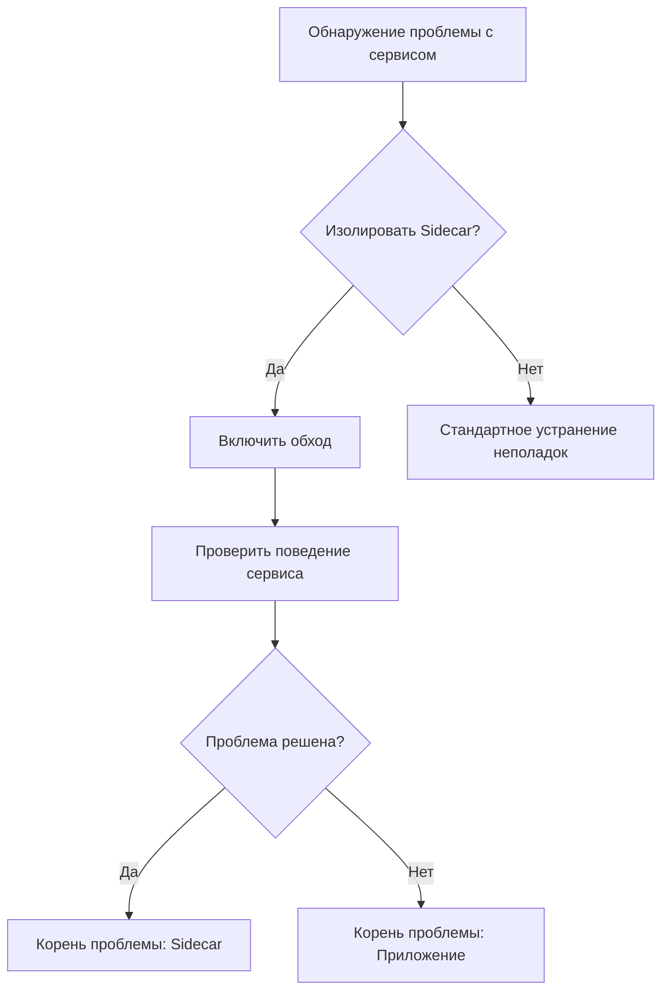
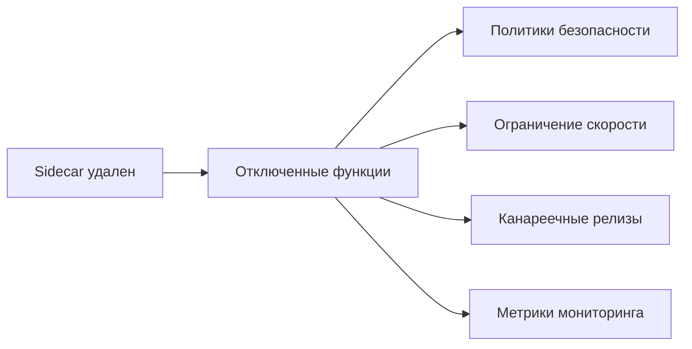

# Расширенные операции с Sidecar

## Введение

Расширенные операции с Sidecar обеспечивают гранулярный контроль над поведением прокси Istio в рамках сервисных сетей. Эта функциональность:

- Оптимизирует сетевую производительность за счет целенаправленного управления трафиком
- Позволяет проводить отладку и устранение неисправностей без прерывания работы
- Предоставляет возможности экстренного обхода
- Сохраняет оперативную гибкость в сложных средах

Основная ценность: Увеличенная наблюдаемость и контроль над компонентами сервисной сети

## Функции

- Конфигурация пропуска трафика
- Режим обхода на уровне Pod
- Динамическая настройка уровня логирования
- Полное удаление Sidecar

## Преимущества

**Точный контроль**: Управление трафиком по конкретным портам/IP-диапазонам\
**Без нарушения работы**: Режим обхода без перезапуска пода\
**Диагностическая поддержка**: Изменения уровня логирования во время выполнения\
**Резервная защита**: Возможность полного удаления Sidecar

## Конфигурация пропуска трафика

### Параметры конфигурации

| Параметр        | Тип     | Описание                         |
| ---------------- | -------- | ----------------------------------- |
| Порт назначения | Исходящий | Целевой порт сервиса (например, 6379)    |
| IP сегмент      | Исходящий | CIDR нотация (например, 10.0.0.0/8)    |
| Порт контейнера  | Входящий  | Открытый порт сервиса (например, 8080) |

### Шаги реализации

1. Перейдите в: **Список сервисов** > **Целевой сервис**
2. Выберите **Подробности** > **Конфигурация Sidecar**
3. Настройте правила пропуска:
   - Добавьте исходящие порты/IP диапазоны
   - Укажите входящие порты контейнера
4. Подтвердите перезапуск развертывания

**Примечание**: Запускает полный перезапуск развертывания - запланируйте окно технического обслуживания

## Управление режимом обхода

### Операционный процесс



### Шаги выполнения

1. Найдите целевой Pod: вкладка **Pods**
2. Активируйте обход:  > **Режим обхода**
3. Переключите переключатель ➔ **ОК**
4. Перезапустите компонент Istiod (необходимы административные права)

**Требования**:

- Kubernetes ≥v1.23
- Pod в состоянии работы
- Нет ожидающих обновлений Sidecar

## Контроль логов Sidecar

### Уровни логирования

| Уровень | Постоянство | Случай использования               |
| ----- | ----------- | ------------------------ |
| trace | Временный   | Отладка на уровне протоколов |
| debug | Оба         | Проблемы с соединением        |
| info  | Постоянный  | Мониторинг на производстве    |

### Процесс обновления

1. Доступ к деталям сервиса
2. Нажмите 
3. Выберите уровень и режим:
   ```yaml
   logLevel: debug
   persistence: temporary
   ```
4. Подтвердите обновление

**Синхронизация кластера**: Автоматически распространяется на многокластерные развертывания

## Удаление Sidecar

### Анализ воздействия



### Процедура удаления

1. Убедитесь, что нет активных канареечных релизов
2. Выполните **Действия** > **Удалить Sidecar**
3. Подтвердите операцию:
   ```bash
   kubectl delete sidecar <service-name>
   ```

**Восстановление**: Требует повторной инъекции через конфигурацию сервисной сети
