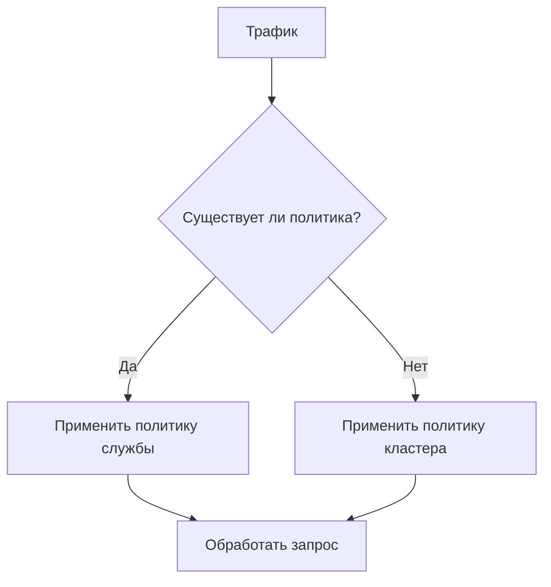

# Политики управления службами

## Введение

Политики управления службами позволяют точно контролировать коммуникацию между службами через конфигурации DestinationRule в Istio. Эти политики касаются:

- Предотвращения каскадных сбоев служб
- Оптимизации распределения ресурсов
- Управления сценариями с высоким трафиком
- Обеспечения согласованности сессий

Основная ценность: Поддержание стабильности и производительности служб при изменяющихся нагрузках

## Особенности

- Цепной предохранитель с многоуровневой изоляцией
- Четыре алгоритма балансировки нагрузки
- Ограничения соединений, специфичные для протокола
- Политики на уровне кластера и конкретной службы

## Преимущества

**Устойчивость к сбоям**: Автоматическая изоляция подов при ошибках  
**Гибкость**: Несколько стратегий балансировки нагрузки  
**Защита**: Механизмы ограничения соединений  
**Контроль приоритета**: Возможность переопределения на уровне службы  

## Политика цепного предохранителя

### Параметры политики

| Параметр             | Описание                                   | Ограничения |
| --------------------- | ------------------------------------------- | ----------- |
| Последовательные 5xx ошибки | 5 последовательных ошибок запускают изоляцию | ≥1          |
| Интервал проверки     | Частота проверки состояния                  | По умолчанию 30с |
| Время базовой изоляции | Начальная продолжительность изоляции      | Минимум 30с |
| Максимальный процент эжекции | Максимальное соотношение изолированных подов | Максимум 50% |

### Рабочий процесс конфигурации

1. **Уровень кластера**:
   - Перейти: **Сервисная сетка** > **Сетки** > **Политики сетки**
   - Создать политику, действующую на все сервисы кластера

2. **Уровень службы**:
   - Перейти: **Список служб** > **Целевая служба** > **Политики**
   - Создать политику переопределения

**Приоритет**: Политики службы > Политики кластера

## Стратегии балансировки нагрузки

### Типы алгоритмов

| Тип              | Метод выбора                  | Случай использования  |
| ---------------- | ----------------------------- | --------------------- |
| Наименьшее количество запросов | Выбор из 2 наименее загруженных подов  | Высокая конкуренция   |
| Случайный        | Случайный выбор              | Простое распределение |
| Круговая       | Последовательное распределение | Равномерное использование |
| Сессийная привязка | Последовательное хеширование | Состояние приложений   |

### Опции сохранения сессии

```yaml
sessionAffinity:
  httpHeaderName: "User-Agent"
  httpCookie:
    name: "sessionID"
    ttl: "3600s"
```

| Метод    | Конфигурация       |
| --------- | ------------------- |
| Заголовок | Пользовательское имя заголовка |
| IP-адрес источника | переключатель true/false |
| Файл cookie | Имя/Путь/TTL     |

**Примечание**: Отключает региональную балансировку нагрузки при включении

## Управление пулом соединений

### Параметры HTTP/HTTP2

| Параметр        | По умолчанию | Описание                          |
| ---------------- | ------------ | --------------------------------- |
| Максимальные соединения | 1024      | Параллельные соединения на под   |
| Максимальные запросы | 1024      | Параллельные HTTP2 запросы        |
| Максимальные попытки  | 3       | Лимит на количество попыток повторения |

### Параметры TCP

| Параметр             | По умолчанию | Описание                |
| --------------------- | ------------ | ----------------------- |
| Таймаут соединения    | 30с          | Таймаут рукопожатия TCP |
| Максимальные соединения | 1024         | Активные TCP соединения |

### Этапы конфигурации

1. Доступ к информации о службе
2. Перейти на вкладку **Политики**
3. Выбрать тип протокола (HTTP/TCP)
4. Установить ограничения соединений

## Операционные ограничения

1. **Цепной предохранитель**:
   - Требует ≥2 здоровых подов для эффективности
   - Политики, специфичные для службы, переопределяют настройки кластера

2. **Балансировка нагрузки**:
   - Алгоритм по умолчанию - LEAST_REQUEST
   - Привязка сессий несовместима с региональной нагрузкой

3. **Пул соединений**:
   - Параметры применяются для каждого пода-клиента
   - Максимальное количество ожидающих запросов для HTTP 1.1: 1024

## Иерархия политик


