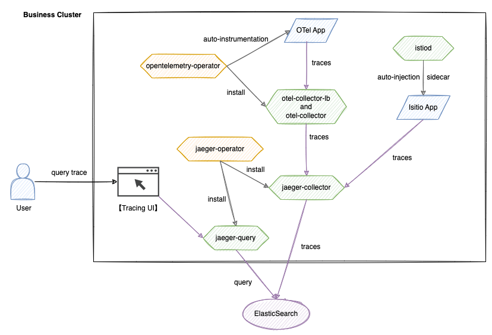

# 架构

该架构建立在 Istio、OpenTelemetry 和 Jaeger 技术栈之上，实现分布式追踪的完整生命周期管理。系统由五个核心模块组成：数据收集、传输、存储、查询和可视化。

## 核心组件

1. **Istio 系统**
   - **istio-proxy**\
     一个侧车代理，自动捕获和生成服务间通信的追踪数据，无需代码修改。
   - **istiod**\
     控制 istio-proxy 的配置和生命周期，包括服务网格的追踪配置。

2. **OpenTelemetry 系统**
   - **opentelemetry-operator**\
     负责部署和管理 otel-collector 组件的集群级 Operator，提供 OTel 自动注入能力。
   - **otel-collector**\
     接收来自应用程序的追踪数据，进行过滤和批处理，然后将其转发到 jaeger-collector。
   - **追踪 UI**\
     自行开发的可视化接口，与 jaeger-query API 集成，支持多维查询条件。

3. **Jaeger 系统**
   - **jaeger-operator**\
     部署和管理 jaeger-collector 和 jaeger-query 组件。
   - **jaeger-collector**\
     接收由 otel-collector 转发和处理的追踪数据，执行格式转换，并将其写入 Elasticsearch。
   - **jaeger-query**\
     提供追踪查询 API，支持包含 TraceID 和标签的多条件检索。

4. **存储层**
   - **Elasticsearch**\
     一个分布式存储引擎，支持大规模 Span 数据的高效写入和检索。

## 数据流

- **Istio 写入过程**\
  `Application -> jaeger-collector -> Elasticsearch`

  istio-proxy 自动捕获服务间通信的追踪数据，然后直接发送到 jaeger-collector，在 Elasticsearch 中持久化。

- **OpenTelemetry 写入过程**\
  `Application -> otel-collector -> jaeger-collector -> Elasticsearch`

  应用程序通过 SDK 或自动注入生成 Span 数据，经过 otel-collector 标准化后，最终由 jaeger-collector 持久化到 Elasticsearch。

- **查询过程**\
  `User -> 追踪 UI -> jaeger-query -> Elasticsearch`

  用户通过 UI 提交查询条件，jaeger-query 从 Elasticsearch 检索数据；UI 根据返回的数据进行可视化展示。
