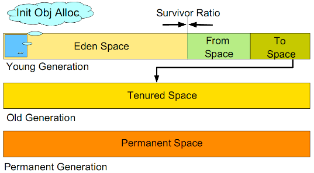

# JVM 内存的深入理解

## 堆内存

在 Java 程序执行过程中，Java 虚拟机将其管理的主内存划分为多个区域，每个区域存储不同类型的数据。其中最大的内存区域称为堆（Heap），它是 Java 虚拟机的运行时数据区，用于存储所有实例和数组。

堆是在 Java 虚拟机启动时创建的，所有线程共享该堆，同时也是垃圾收集器的主要工作区，因此这部分区域也称为 **堆内存** 或 **GC 堆**。当垃圾收集器在堆中回收数据时，它会扫描并清理使用 `new` 关键字创建的无用对象，以释放内存并避免内存资源的浪费。

为了提高垃圾收集的效率，堆内存进一步划分为新生代、老年代和永久代。

- **新生代**：包括 Eden 区、SurvivorFrom 区和 SurvivorTo 区，用于存储新创建的对象。大多数新对象会在 Eden 区分配（如果一个对象太大，则会直接分配到老年代），新生代的垃圾收集过程称为 **Minor GC**。当 Eden 区的内存不足时，会触发 Minor GC。  在 Minor GC 开始之前，对象仅存在于 Eden 区和 SurvivorFrom 区；在 Minor GC 过程中，来自 Eden 区和 SurvivorFrom 区的存活对象被移动到 SurvivorTo 区，并且它们的年龄增加 1，Eden 区和 SurvivorFrom 区被清空；在 Minor GC 之后，SurvivorFrom 区和 SurvivorTo 区的功能进行交换，在下次 Minor GC 中，来自 SurvivorTo 区和 Eden 区的存活对象被移动到 SurvivorFrom 区，并计算对象的年龄。当对象的年龄达到 15 时，将被分配到老年代。

- **老年代**：也称为长期存活区，用于存储从新生代中存活下来的对象。从老年代区域的垃圾收集过程被称为 **Major GC**。老年代存储较为稳定的对象，不会频繁执行 Major GC。只有在新的对象进入老年代导致空间不足，或程序无法找到足够大的连续空间分配给新创建的大对象时，才会触发 Major GC。  由于需要扫描和回收，Major GC 的时间较长。Major GC 会产生内存碎片，并且当老年代也没有足够的内存分配给新来对象时，会抛出 OOM（内存溢出）异常。

- **永久代**：也称为永久存储区域，主要存储类和元数据（metadata）信息。在 Java 8 中，永久代被移除，并被 Metaspace 区域取代。Metaspace 不在虚拟机内，而是使用本地内存。因此，默认情况下，Metaspace 的大小仅受本地内存的限制。

## 非堆内存

非堆内存指的是在 Java 虚拟机的堆外管理的内存区域，在 Java 虚拟机的堆内存之外分配一些对象实例，这些实例直接由操作系统（而不是虚拟机）管理，包括代码缓存区、Metaspace/永久空间。

区域说明见下表。

| 非堆内存区域        | 描述                                                                               |
| -------------------- | ---------------------------------------------------------------------------------- |
| **代码缓存**         | 用于编译和存储本地代码的区域。                                                    |
| **永久空间**         | 存储虚拟机静态数据的区域，例如类和方法对象。                                      |
| **Metaspace**        | Metaspace，用于存储本地内存中的类元数据的区域。                                  |
| **直接缓冲区**       | 直接缓冲区区域。                                                                  |
