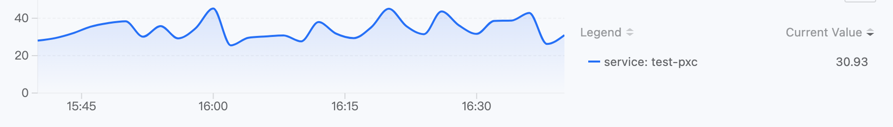
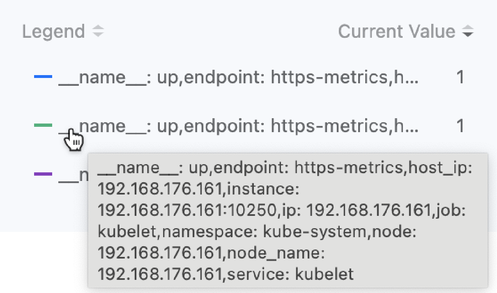
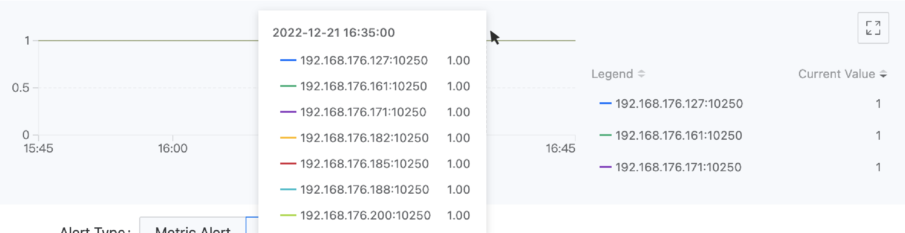

# 告警策略

您可以在 ASM 平台上自行创建自定义告警策略，或者可以使用管理员在平台管理中提供的模板快速创建一个。

## 创建个性化告警策略

根据平台的监控、日志和事件数据，结合平台的通知功能，为当前服务网格中同一命名空间下的服务和计算组件创建指标告警、自定义告警、日志告警和事件告警类型。当告警策略所针对的资源出现异常或监控数据达到预定义的警告状态时，告警会自动触发并发送通知。

### 前提条件

- 如果您希望告警配置能够自动通知，请提前联系平台管理员以在 **平台管理** 视图中配置 **通知策略**。

- 确保告警策略资源所在的集群已部署监控组件，以便基于监控指标创建的告警策略能够生效。

- 确保告警策略资源所在的集群已部署 Elasticsearch 组件，以便基于日志和事件查询结果创建的告警策略能够生效。

### 快速开始

1. 在左侧导航栏中，点击 **告警** > **规则**。

2. 点击 **创建规则**。

### 基本信息

在 **基本信息** 区域，配置告警策略的基本信息。您需要先选择不同类型的告警。

**资源告警**

按照监控资源类别划分的告警类型，例如以下两种场景：

1. 您可以持续监控当前命名空间下的某些或所有部署，当它们的部署状态不是 Running 时触发告警。
2. 您可以持续监控当前命名空间下的特定微服务，当其服务流量错误率超过 20% 时触发告警。

提示：

- 如果未选择资源对象中的相关参数，将默认设置为 **任何**。后续对资源对象的 **删除/添加** 会 **解除/自动关联** 告警策略。
- **服务** 是可选的，也可以通过输入并按 Enter 来指定。在输入时，支持使用正则表达式匹配服务名称，例如 `cert.*`。

**事件告警**

按照 K8s 事件划分的告警类型，例如以下场景：

对于当前命名空间下名为 Nginx 的 Pod，在添加匹配规则后，当该 Pod 的状态为 Failed 时，可以触发告警。

提示：如果在匹配规则中未做选择，则会选择某些资源下的所有资源，后续对资源的 **删除/添加** 会 **解除/自动关联** 告警策略。

**快速提示**

如果您希望持续监控 OpenTelemetry 服务，请选择 **资源告警** 并将治理方式选择为 **OpenTelemetry**。

### 告警规则

一旦您根据上述说明选择了告警类型并设置了监控范围，您可以添加相应的告警规则。

#### **资源告警**

1. 在 **规则** 区域，点击 **添加告警规则**。

   **注意**：对话框上方显示的监控图表提供了监控指标或表达式的数据预览，其会根据您的选择实时变化。您可以根据图表确认您的输入。

   

2. 选择告警类型并参考以下说明配置告警规则。

**指标告警**：选择平台预设的告警指标。

**自定义告警**

请参考以下说明输入相关数据：

- 指标名称：输入当前自定义指标的名称，以便于管理和检索。
- 表达式：根据您的监控场景，需要添加特定的指标规则以满足高级监控和告警需求。需手动输入可被 Prometheus 识别的指标和监控表达式，例如：`rate(node_network_receive_bytes{instance="$server",device!~"lo"}[5m])`。
- 单位：监控指标的单位，可以作为自定义单位手动输入。
- 图例参数：为了方便在图例上显示和查看数据，您可以输入监控数据的标签作为 ***key***，与该 key 对应的 `value` 将作为图例标识符。输入格式为：`{{.key}}`。

**图例参数设置说明**：输入正确的表达式后，将光标移动到对话框上方监控图表右侧的排名统计列表记录上，可以查看数据的所有标签。如图所示。

例如：通过表达式 `up{service="kubelet"}` 获取的监控数据标签包括 `"__name__":"up","endpoint":"https-metrics","instance":"192.168.18.2:10250","job":"kubelet","namespace":"kube-system","node":"192.168.18.2","service":"kubelet"`。如果希望使用收集数据的目标端点作为图例标识符，可以输入图例参数 `{{.instance}}`。显示效果如以下图所示。

3. 输入触发条件

**触发条件** 包括比较运算符、告警阈值和持续时间（可选）。监控指标的实时值/日志计数/事件计数与告警阈值之间的比较结果，以及实时值保持在告警阈值范围内的持续时间，决定是否触发告警。

**比较运算符**：**>**（大于）、**>=**（大于或等于）、**==**（等于）、**\<=**（小于或等于）、**\<**（小于）、**!=**（不等于）。

**阈值**：告警阈值只接受数字。当选择的黑盒监控项的 **检测方法** 为 `HTTP` 且选择的 **指标名称** 为 `cluster.blackbox.http.status.code` 时，告警阈值为 HTTP 请求的返回状态码，仅支持输入 3 位正整数，例如：200。

**持续时间**：指标数据实时值保持在告警阈值范围内的持续时间。当持续时间等于指定时间时，触发告警。

4. 选择告警级别

告警规则的告警级别，由用户设定，允许用户根据告警规则对应资源对业务运营的影响设定合理的告警级别。

**严重**：告警规则对应的资源故障导致平台业务中断、数据丢失并产生重大影响。例如：某节点的健康状态值为 0（故障），持续 3 分钟。

**高**：告警规则对应的资源存在已知问题，可能造成平台功能故障，影响正常业务运行。例如：某计算组件的可用 Pod 组数量为 0，持续 3 分钟。

**中**：告警规则对应的资源存在运营风险，如不及时处理，可能影响正常业务运行。例如：某节点 CPU 使用率超过 80%，持续 3 分钟。

**低**：告警规则对应的资源存在预期问题，短期内不会影响业务运行，但存在潜在风险。例如：某节点 CPU 使用率超过 70%，持续 3 分钟。

5. 点击 **添加**。

#### **事件告警**

1. 选择 **事件告警** 作为告警类型后，在 **规则** 区域，点击 **添加告警规则**。

2. 选择时间范围。例如：如果时间范围设置为 5 分钟，则在创建告警后，如果在任何 5 分钟内事件数量达到指定条件，就会触发告警。

3. 事件监控项
   监控所选事件的事件级别或事件原因。

- **事件严重性**：为所选事件定义的严重性级别，例如，警告。
- **事件原因**：事件的具体原因（理由，例如，BackOff、Pulling、Failed 等），通过按 Enter 键确认。可以输入多个字段，在查询过程中多个字段之间关系为 `or`，即包含任何指定事件原因的记录均满足查询条件。

4. 触发条件

   触发条件使用比较运算符来根据事件记录数量的比较结果判断是否告警。

5. 告警级别

   告警规则的告警级别，由用户设定，允许用户根据告警规则对应资源对业务运营的影响设定合理的告警级别。

   **严重**：告警规则对应的资源故障导致平台业务中断、数据丢失并产生重大影响。例如：某节点的健康状态值为 0（故障），持续 3 分钟。

   **高**：告警规则对应的资源存在已知问题，可能造成平台功能故障，影响正常业务运行。例如：某计算组件的可用 Pod 组数量为 0，持续 3 分钟。

   **中**：告警规则对应的资源存在运营风险，如不及时处理，可能影响正常业务运行。例如：某节点 CPU 使用率超过 80%，持续 3 分钟。

   **低**：告警规则对应的资源存在预期问题，短期内不会影响业务运行，但存在潜在风险。例如：某节点 CPU 使用率超过 70%，持续 3 分钟。

6. 点击 **添加**。

#### **结果验证**

无论您选择自定义告警还是事件告警，添加后弹出窗口会关闭，您添加的条目会显示在创建告警策略页面的 **规则** 列表中。

### 通知策略配置（可选）

如果您已在管理页面创建了通知策略，则可以在 **策略配置** 区域中设置触发告警后的通知操作。

1. 点击 **通知策略** 下拉框，选择在平台上创建的一个或多个通知策略。

2. 选择 **告警通知间隔**，配置从告警触发到恢复正常之间发送告警消息的间隔。

- **全局**：选择使用平台的全局默认配置。全局配置支持更新。

- **自定义**：选择 **自定义** 后，可以通过点击告警级别旁边的下拉框调整发送告警消息的间隔。 **注意**：选择 **不重复** 时，告警触发时以及恢复正常时只发送一条告警消息。

### 完成

确认输入的信息无误后，点击 **创建** 以完成操作。您可以在告警策略列表中管理和查看每个策略的当前状态（例如，是否触发了告警）。

## 使用告警策略模板创建告警策略

使用平台上创建的告警模板快速为指定的计算组件创建告警策略。

### 前提条件

- 管理员在平台上为计算组件创建了告警模板（ **平台管理视图 > 操作中心 > 告警 > 告警模板**）。

- 确保告警策略资源所在的集群已部署监控组件，以便基于监控指标创建的告警策略能够生效。

- 确保告警策略资源所在的集群已部署 Elasticsearch 组件，以便基于日志和事件查询结果创建的告警策略能够生效。

### 步骤

1. 在左侧导航栏中，点击 **告警** > **规则**。
2. 点击  在 **创建规则** 按钮旁边 > **从模板**。
3. 配置告警策略的基本信息，并选择 **资源对象** 和 **所属集群**。
4. 点击 **创建**。

## 后续操作

### 查看实时告警

您可以在告警策略列表中查看您创建的告警策略的当前告警状态。

此外，为了提供更清晰的当前告警情况展示，平台还提供了 **实时告警** 面板功能，集中显示当前正在经历告警的资源、告警的影响级别以及您有权限的当前服务网格下各集群的详细告警信息。这有助于运维人员和开发者实时掌握平台整体的业务告警情况，及时处理故障因素，确保平台的正常运行。

### 禁用/启用告警规则

为了方便政策下规则的灵活管理，支持在创建的告警策略中禁用/启用规则。禁用时，规则的状态变为 `-`，且该规则不计入告警策略规则的总数；当重新启用该规则时，规则中包含的触发告警的条件将再次生效。

**步骤**

1. 在左侧导航栏中，点击 **告警** > **规则**。

2. 点击要管理的规则的 ***名称***。

3. 在 **告警条件** 区域，点击要禁用/启用的规则旁边的 **禁用/启用** 开关。
