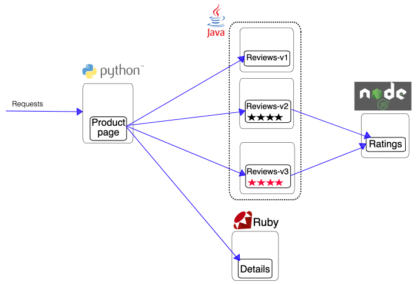
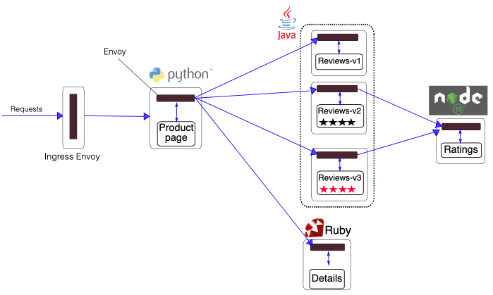
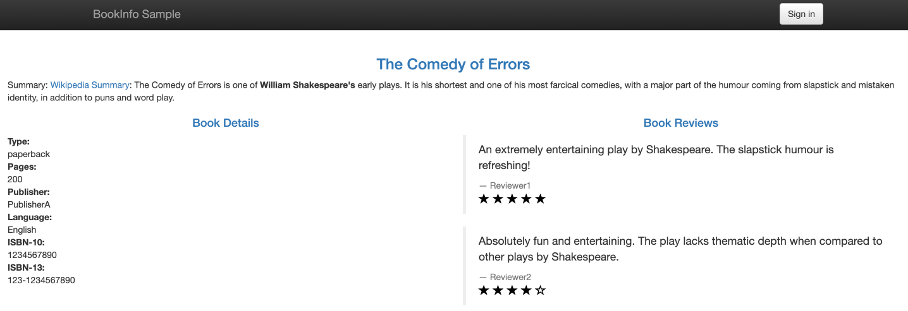
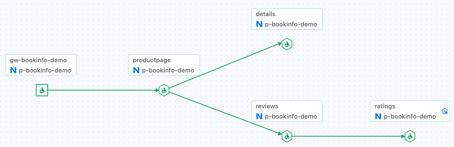

# 部署示例应用程序 Bookinfo

参考本文档在同一命名空间中跨多个集群部署 Bookinfo 应用程序，以验证多集群服务网格的能力。

## 准备项目和命名空间

为部署应用程序准备项目和命名空间，具体的配置要求如下：

- 所有集群必须与平台现有的项目相关联，作为**关联集群**。
- 所有集群中必须存在用于部署应用程序的同名命名空间。

  **注意**：基于多集群服务网格的跨区域灾备或负载均衡只能在同名命名空间中的同名服务之间发生。

您可以通过以下说明准备项目和命名空间：

{/* TODO: [创建项目](@console-platform-docs/zh/project-usermanual/project/1addproject/) */}

1. 参考 [创建项目]() 在平台上创建一个包含**关联集群** `c1` 和 `c2` 的项目。

{/* TODO: [创建命名空间](@console-platform-docs/zh/project-usermanual/namespace/1createns/) */}

2. 参考 [创建命名空间]() 在集群 `c1` 和 `c2` 中创建同名命名空间 `ns1`。

## 在多个集群中部署 Bookinfo 应用程序

在集群 `c1` 和 `c2` 的同名命名空间 `ns1` 中部署 Bookinfo 应用程序。

### 先决条件

您需要一个平台可访问的镜像库，并且可以将镜像推送到该库。

:::note

本文档以 Harbor 为例。您需要在 Harbor 中准备一个项目以便上传镜像（将**访问级别**设置为 `public`），并将该项目分配给平台上为 Bookinfo 准备的项目。您可以在平台上部署或集成镜像管理工具 Harbor，并将用于上传镜像的 Harbor 项目分配给平台上为 Bookinfo 准备的项目。

:::

### 应用程序介绍

Bookinfo 是 Istio 提供的示例应用程序，模拟一个在线书店。它由四个独立的服务组成，这些服务一起提供查看书籍描述、书籍详细信息（ISBN、页数等）和一些书评的功能。

构成 Bookinfo 的服务如下：

| 服务名称     | 描述                                                                                                                                                                                                                                                                                                                                                                                                                                                                                                   |
| ------------ | ----------------------------------------------------------------------------------------------------------------------------------------------------------------------------------------------------------------------------------------------------------------------------------------------------------------------------------------------------------------------------------------------------------------------------------------------------------------------------------------------------- |
| productpage  | 调用详细信息和评论服务以生成页面。                                                                                                                                                                                                                                                                                                                                                                                                                                                                           |
| details      | 包含书籍的信息。                                                                                                                                                                                                                                                                                                                                                                                                                                                                                          |
| reviews      | 包含书籍的评论，并调用评分服务。<br /><br />评论服务有三个版本：<br />v1：不调用评分服务。<br />v2：调用评分服务并显示 1 到 5 星的评分  。<br />v3：调用评分服务并显示 1 到 5 星的评分  。<br />**提示**：默认部署 v2 版本。 |
| ratings      | 包含由书籍评估组成的评分信息。                                                                                                                                                                                                                                                                                                                                                                                                                                                                          |

Bookinfo 的端到端架构如下所示。



### 准备镜像和 YAML 文件

在平台上部署 Bookinfo 应用程序之前，您需要从**客户门户**系统下载部署 Bookinfo 应用程序所需的镜像和 YAML 文件。

通过执行脚本，标记镜像并将其上传到平台可访问的镜像库，并相应地修改 YAML 文件中的镜像地址。确保在部署应用程序时，平台能够平稳地拉取所需的镜像。

#### **步骤**

1. 登录客户门户，在**应用市场**中搜索 **Bookinfo**，并将提供的产品文件下载到本地计算机。

   :::tip
   有关访问客户门户系统的权限，请联系技术支持。
   :::

2. 打开本地终端并按以下命令解压下载的文件并加载镜像。

   ```sh
   unzip <file_name>.zip
   docker load -i images.tar
   ```

   :::note
   解压后，您将得到以下文件：

   - `images.tar`：Bookinfo 的镜像包。
   - `bookinfo.yaml`：Bookinfo 的 YAML 文件。
   - `docker_script.sh`：用于标记镜像、上传镜像和修改 YAML 文件中镜像地址的脚本。
     :::

3. 执行以下命令以登录到平台可访问的镜像库。

   :::note
   将 `<Harbor address>` 替换为平台上实际可访问的 Harbor 地址，例如: `registry-harbor.example.com`。
   :::

   ```sh
   docker login <Harbor address>
   ```

   :::note
   如果在输入用户名和密码后收到以下错误，请修改**Docker 引擎**配置，将 Harbor 地址添加到**insecure-registries**中，然后重新执行登录命令。
   :::

   ```sh
   Error response from daemon: Get "https://<Harbor address>/v2/": http: server gave HTTP response to HTTPS client
   ```

4. 修改 **docker_script.sh** 脚本文件。

   将 `<Harbor address>` 替换为您希望上传镜像的**Harbor 项目地址**，例如: `registry-harbor.example.com/bookinfo`。

5. 按顺序执行以下命令。

   以下命令执行**docker_script.sh**脚本以标记镜像、将镜像上传到 Harbor 项目，并修改 **bookinfo.yaml** 文件中的镜像地址。

   ```sh
   chmod +x docker_script.sh
   ./docker_script.sh
   ```

### 一键式应用程序部署

在**容器平台**上，使用 YAML 在集群 `c1` 的命名空间 `ns1` 中创建一个 **原生应用程序** 以部署 Bookinfo 应用程序。

#### **步骤**

1. 在顶部导航栏中，点击产品视图切换，以切换到 **容器平台**，并进入集群 `c1` 下的命名空间 `ns1`。

2. 在左侧导航栏中，点击 **应用管理** > **原生应用程序**。

3. 点击 **创建原生应用程序**，并选择 **使用 YAML 一键创建**。

4. 输入应用程序名称，在 YAML 编辑器中单击 **导入**，选择 **bookinfo.yaml**，然后点击 **创建**。

5. 重复上述步骤，在集群 `c2` 的命名空间 `ns1` 中部署 Bookinfo 应用程序。

### 为应用程序服务注入侧车

在**服务网格**平台中，添加构成 Bookinfo 应用程序的服务 `productpage`、`details`、`reviews` 和 `ratings`，并使用 **服务网格治理模式**。添加服务时，平台会自动将侧车注入这些服务中。

侧车注入后，Bookinfo 的架构如下所示。



#### **步骤**

1. 在顶部导航栏中，点击产品视图切换，以切换到 **服务网格**。

2. 在左侧导航栏中，点击 **服务列表**。

3. 点击 **添加服务**，并选择 **服务网格治理模式**。

4. 配置相关参数后点击 **创建**。

   :::note
   除非另有说明，请选择部署并使用界面上的参数默认值。

   - 重复上述步骤在集群 `c1` 和 `c2` 的命名空间 `ns1` 中添加服务 `productpage`、`details`、`reviews` 和 `ratings`。
     :::

## 通过 Ingress 网关访问 Bookinfo 应用程序

### 步骤

参考 [使用 Ingress 网关](../../trafficmanagement/ingress_gateway/) 在集群 `c1` 中部署 Ingress 网关，并创建网关配置和路由配置，通过浏览器访问在集群中部署的 Bookinfo 应用程序。

根据需要配置相关参数，并根据需要配置其他参数。

- **Ingress 网关**：

  - **内部路由类型**：`LoadBalancer`。

  - 端口包含 HTTP 协议端口。

- **网关配置**：选择 HTTP 协议的端口。

- **路由配置**：**路由目的地**选择 `namespace ns1 in cluster c1`、`internal routing productpage` 和端口 `9080`。

### 访问验证

点击路由配置中的 **外部访问地址**，在打开的页面左下角选择模拟用户类型（**普通用户/测试用户**），您就可以访问 `productpage` 服务，并查看由 `productpage` 服务调用的 `reviews` 服务版本显示的评分信息。



服务调用拓扑如下面所示。


