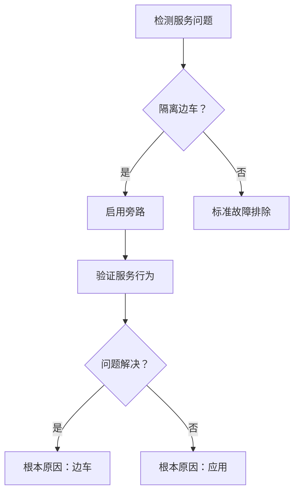
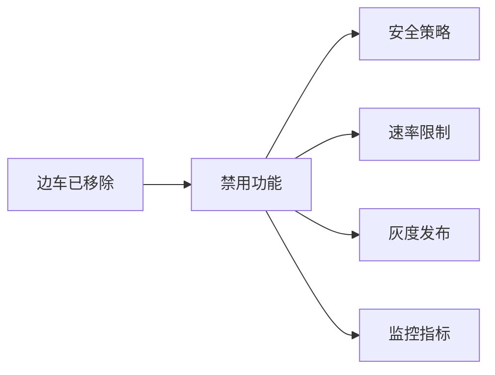

# 高级边车操作

## 介绍

高级边车操作提供了对服务网格中 Istio 代理行为的细粒度控制。该功能：

- 通过针对性的流量处理优化网络性能
- 实现非干扰式调试和故障排除
- 提供紧急旁路能力
- 在复杂环境中保持操作灵活性

核心价值：增强对服务网格组件的可观察性和控制能力

## 特性

- 流量旁路配置
- Pod 级旁路模式
- 动态日志级别调整
- 完全移除边车

## 优势

**精准控制**：针对端口/IP 范围的特定流量管理\
**非干扰**：旁路模式无需重启 Pod\
**诊断支持**：运行时日志级别修改\
**故障安全**：完全移除边车的能力

## 流量旁路配置

### 配置参数

| 参数              | 类型     | 描述                                   |
| ---------------- | -------- | ------------------------------------- |
| 目标端口         | 出站     | 目标服务端口（如：6379）             |
| IP 段            | 出站     | CIDR 表示法（如：10.0.0.0/8）        |
| 容器端口         | 入站     | 服务暴露的端口（如：8080）           |

### 实施步骤

1. 导航到：**服务列表** > **目标服务**
2. 选择 **详情** > **边车配置**
3. 配置旁路规则：
   - 添加出站端口/IP 范围
   - 指定入站容器端口
4. 确认部署重启

**注意**：触发完整的部署重启 - 计划维护窗口

## 旁路模式管理

### 操作工作流



### 执行步骤

1. 定位目标 Pod：**Pods** 标签
2. 激活旁路： > **旁路模式**
3. 切换开关 ➔ **确定**
4. 重启 Istiod 组件（需要管理员权限）

**要求**：

- Kubernetes ≥v1.23
- Pod 状态为运行中
- 无待处理的边车更新

## 边车日志控制

### 日志级别

| 级别   | 持久性   | 用例                      |
| ------ | -------- | ------------------------ |
| trace  | 临时     | 协议级调试              |
| debug  | 二者     | 连接问题                 |
| info   | 永久     | 生产监控                |

### 更新过程

1. 访问服务详情
2. 点击 
3. 选择级别和模式：
   ```yaml
   logLevel: debug
   persistence: temporary
   ```
4. 确认更新

**集群同步**：自动传播到多集群部署

## 边车移除

### 影响分析



### 移除程序

1. 确认没有活动的灰度发布
2. 执行 **操作** > **移除边车**
3. 确认操作：
   ```bash
   kubectl delete sidecar <service-name>
   ```

**恢复**：需要通过服务网格配置重新注入
