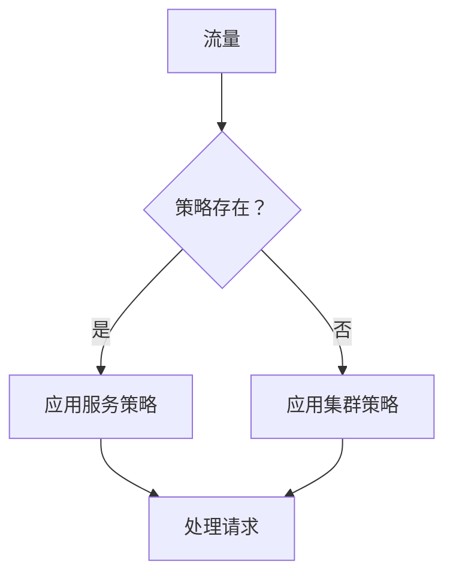

# 服务治理策略

## 介绍

服务治理策略通过 Istio 的 DestinationRule 配置实现对服务间通信的精确控制。这些策略解决了：

- 防止级联服务故障
- 优化资源分配
- 管理高流量场景
- 确保会话一致性

核心价值：在不同负载下保持服务的稳定性和性能

## 特性

- 多级隔离的断路器
- 四种负载均衡算法
- 按协议特定的连接限制
- 集群范围和服务特定的策略

## 优势

**容错性**：错误时自动隔离 pod  
**灵活性**：多种负载均衡策略  
**保护机制**：连接限流机制  
**优先级控制**：服务级别的覆盖能力  

## 断路器策略

### 策略参数

| 参数                | 描述                                 | 约束        |
| ----------------- | ------------------------------------ | ---------- |
| 连续 5xx 错误      | 5 次连续错误触发隔离                | ≥1         |
| 检查间隔           | 健康检查频率                         | 默认 30s   |
| 基础隔离时间       | 初始隔离持续时间                     | 最小 30s   |
| 最大排除百分比     | 最大隔离 pods 比例                   | 最大 50%   |

### 配置工作流程

1. **集群级别**：
   - 导航至: **服务网格** > **网格** > **网格策略**
   - 创建影响所有集群服务的策略 

2. **服务级别**：
   - 导航至: **服务列表** > **目标服务** > **策略**
   - 创建覆盖策略 

**优先级**：服务策略 > 集群策略

## 负载均衡策略

### 算法类型

| 类型               | 选择方法                          | 使用场景             |
| ----------------- | --------------------------------- | ------------------- |
| 最少请求           | 从 2 个最闲的 pods 中选择         | 高并发               |
| 随机              | 随机选择                          | 简单分配             |
| 轮询              | 顺序分配                          | 均衡利用             |
| 会话亲和性        | 一致性哈希                        | 有状态应用           |

### 会话持久性选项

```yaml
sessionAffinity:
  httpHeaderName: "User-Agent"
  httpCookie:
    name: "sessionID"
    ttl: "3600s"
```

| 方法        | 配置                  |
| --------- | --------------------- |
| 头部      | 自定义头部名称         |
| 源 IP     | true/false 切换       |
| Cookie    | 名称/路径/Ttl         |

**注意**：启用时禁用区域负载均衡 

## 连接池管理

### HTTP/HTTP2 参数

| 参数                | 默认值 | 描述                           |
| ----------------- | ------ | ----------------------------- |
| 最大连接数        | 1024   | 每个 pod 的并发连接数           |
| 最大请求数        | 1024   | HTTP2 的并发请求               |
| 最大重试次数      | 3      | 重试次数限制                   |

### TCP 参数

| 参数                | 默认值 | 描述                           |
| ----------------- | ------ | ----------------------------- |
| 连接超时          | 30s    | TCP 握手超时                 |
| 最大连接数        | 1024   | 活动的 TCP 连接               |

### 配置步骤

1. 访问服务详细信息 
2. 导航至 **策略** 标签 
3. 选择协议类型 (HTTP/TCP) 
4. 设置连接限制 

## 操作约束

1. **断路器**：
   - 需要 ≥2 个健康的 pods 才能生效
   - 服务特定的策略覆盖集群设置 

2. **负载均衡**：
   - 默认策略为 LEAST\_REQUEST
   - 会话亲和性与区域负载不兼容 

3. **连接池**：
   - 参数适用于每个客户端 pod 
   - HTTP 1.1 最大待处理请求数：1024 

## 策略层次结构


